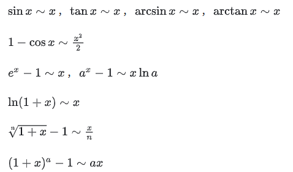
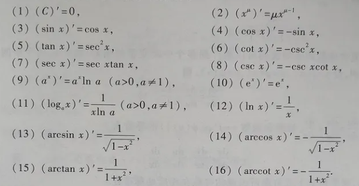

# calculus

**考研数学考察的是你是否有一个基本的数学思维和利用数学工具解决问题的能力，而不是搞数学研究成为数学家的能力。**
**只要你理解一种数学工具，并知道如何使用，出题人不会强人所难。**

****

## 等价无穷小

## 常见的泰勒展开

$$sin(x)=x-\frac{1}{6}x^3+o(x^3)$$

$$sin^{-1}(x)=x+\frac{1}{6}x^3+o(x^3)$$

$$tan(x)=x+\frac{1}{3}x^3+o(x^3)$$

$$tan^{-1}(x)=x-\frac{1}{3}x^3+o(x^3)$$

$$cos(x)=1-\frac{1}{2}x^2+\frac{1}{24}x^4+o(x^4)$$

$$ln(1+x)=x-\frac{1}{2}x^2+\frac{1}{3}x^3+o(x^3)$$

## 三角恒等

* 毕达哥拉斯定理

$cos^2(x)+sin^2(x)=1, \quad x \in R$

* 将两端除以$cos^2(x)$

$1+tan^2(x)=sec^2(x)$

* 若两端除以$sin^2(x)$

$cot^2(x)+1=csc^2(x)$

* 互余的角之和为$\frac{\pi}{2}$

若$T(x)$表示某个三角函数，则

$$T(x) = T_{co}(\frac{\pi}{2} - x)$$

$T_co(x)$表示$T(x)$的余函数版本，并且，余角的余角就是那个角本身。

$$T_{co}(x) = T(\frac{\pi}{2} - x)$$

## 求极限的可行思路

* 有理函数：尝试因式分解，然后消除分子分母中的相同因式。
* 含有平方根：尝试同时乘以共扼表达式
* 趋于无穷的极限

当$x \to \infty$时，首项决定一切。例如，我们求$\lim\limits_{x \to \infty} \frac{5x^3+9x^2+2x+19}{x^3+3x+6}$的极限，很显然，分子和分母都趋近于无穷，这是一个$\frac{\infty}{\infty}$型未定式。然而，当一个多项式$\to$无穷时，我们仅需要关注次数最高的项，故而上式可简化为$\lim\limits_{x \to \infty} \frac{5x^3}{x^3}=5$。

## 介值定理

若$f(x)$连续，$f(x)=a, f(y)=b$，则$\forall c \in [A, B], \exists z \in [x, y], f(z)=c$

### 证明： $x=cos(x)$存在一个解

$f(x)=x-cos(x), x \in R$，$f(x)$在$R$上连续。
$f(\frac{\pi}{3})=\frac{\pi}{3}-\frac{1}{2} > 0$
$f(-\frac{\pi}{3})=-\frac{\pi}{3}-\frac{1}{2} < 0$
故而，必有$x \in [-\frac{\pi}{3}, \frac{\pi}{3}], f(x)=0$

## 极值定理

若$f(x), x \in [a, b]$连续，则$f(x)$在$[a,b]$上至少有一个最大值和一个最小值。

## 导数

### 递归思路

任何一个表达式都可以被表示为更简单的表达式的组合，我们要做的，是搞清楚表达式之间的组合，与表达式的导数的组合之间的映射关系。

#### $f(x)+g(x)$

$f(x)+g(x) \to f'(x)+g'(x)$

#### $f(x) \cdot g(x)$

$f(x) \cdot g(x) \to f'(x) \cdot g(x) + f(x) \cdot g'(x)$

#### $\frac{f(x)}{g(x)}$

$\frac{f(x)}{g(x)} \to \frac{f'(x) \cdot g(x) - f(x) \cdot g'(x)}{g^2(x)}$

#### $f(g(x))$ 链式法则

$f(g(x)) \to f'(g(x)) \cdot g'(x)$

#### 余留的问题

$$f(x)=\frac{3x^7+x^4\sqrt{2x^5+15x^{\frac{4}{3}}-23x+9}}{6x^2-4}$$

## 导数和图像

### 函数的极值

若一个一元多项式存在n个根，根集为$S$。则该多项式因式分解的结果为 $$\displaystyle\prod_{i=1}^n x-S_i$$

#### 判断一个临界点是否为局部极值点的方法

* 判断函数的导数在临界点两端的符号是否改变
* 

## 微分

对于$df(x)$，其意义是函数 $f$ 在 $x$ 点的微元增量。
即， $df(x)=\lim \limits_{n \to 0}f(x+n)-f(x)$ 。
而对于
$$\frac{df(x)}{dg(x)}$$
其想要表达的是$f(x)$与$g(x)$的微元增量之比。通俗来讲就是$f$比$g$在同一点$x$上的增长速度谁更快，快多少。而当只需要讨论一个函数的增长速度时，设 $g(x)=x$ 是一个不错的选择，于是就有了
$$\frac{d}{dx}f(x) $$ $$ \frac{df(x)}{dx}=f'(x)$$
毕竟速度这个概念不是绝对的而是相对的，这也正是我们为什么需要一个$dx$放在分母上。当你在地球上讨论速度时，你可以不提你所指的是相对于什么的速度，大多数人会认为你在说关于地面的速度。
但在这里，为了严谨，我们把$dx$写在分母上。

## 积分

考虑式子$f(x) \cdot dx$想要表达的意义。若联系$\frac{df(x)}{dx}=f'(x)$，我们可以得出$df(x)=f'(x) \cdot dx$，即使是从定性的角度有，这也很好理解，$f$在$x$点的速度，乘以$x$的最小增量，就等于$f(x)$的最小增量，不是吗？所以$f(x) \cdot dx$想表达的是，**以$f(x)$为速度的函数的最小增量**
或者我们可以修改一下，就修改成这样吧: $f(x) \cdot dg(x)$。在此时我们可以联系一下$\frac{df(x)}{dg(x)}=\frac{f'(x)}{g'(x)}$，从而得出$$df(x)=\frac{f'(x)}{g'(x)}\cdot dg(x)$$ 而对于修改之后的式子，我们可以这样理解: 相对于$g(x)$的速度为$f(x)$的函数的最小增量。

考虑式子

$$\int^{u}_{l} df(x)$$

其意义是，在$l \to u$上对$f(x)$的微元增量累加。在这个式子中，我们得到$f(u)-f(l)$。

而对于

$$\int^{u}_{l} f(x) \cdot dx$$

若我们设$F(x)$为导函数为$f(x)$的函数。可得

$$\int^{u}_{l} f(x) \cdot dx = \int^{u}_{l} dF(x)$$

对于一个略显复杂的情况：

$$\int^{u}_{l} f(x) \cdot dg(x)$$

若我们设$F(x)$为导函数为$f(x)$的函数，$G(x)$为导函数为$g(x)$的函数，相对于$g(x)$的速度为$f(x)$的函数可以表示为
$$\frac{F(x)}{G(x)}$$

## 泰勒展开

对于任意一个函数$f(x)$，其在$x_0$点处，可以用一个无穷阶的多项式展开

$$f(x)=\sum\limits_{j=0}^{n} a_n(x-x_0)^n$$

为了求出这个累加式中每项的系数$a_n$，我们对等式的两侧同时求n阶导，并重点关注右边。

$$\lim\limits_{x \to x_0}f(x) = a_0$$

若取0阶导数，除首项外的所有项皆因 $\lim\limits_{x \to x_0} (x-x_0)^n=0, n>0 \quad$而被消去，同理

$$\lim\limits_{x \to x_0} f'(x) = [a_1(x-x_0)^1]' = a_1$$

$$\lim\limits_{x \to x_0} f''(x) = [a_2(x-x_0)^2]''=a_2 \cdot 2x \cdot x = 2!a_2$$

$$\lim\limits_{x \to x_0} f^{(n)}(x) = [a_n(x-x_0)]^{(n)} = n!a_n$$

这足以让我们推出$a_n$的表达式

$$a_n=\lim\limits_{x \to x_0} \frac{f^{(n)}(x)}{n!}$$

或者直接代入$x_0$，得

$$a_n=\frac{f^{(n)}(x_0)}{n!}$$

随后，我们可以化简第一个式子

$$f(x)=\sum\limits_{j=0}^{n} \frac{f^{(n)}(x_0)}{n!} \cdot (x-x_0)^n$$

由于我们经常在$x_0=0$处展开，上式还可以特殊化为

$$f(x)=\sum\limits_{j=0}^{n} \frac{f^{(n)}(0)}{n!} \cdot x^n$$

## 积分的方法

### 第一类换元法

* 核心: 被积函数内部存在导数关系

**$$\int x^2cos(x^3)dx$$**

设$t=x^3$，使t的导数在被积函数中。$dt=\frac{1}{3}x^2dx$

$$=\int \frac{1}{3}cos(t)dt \\=\frac{1}{3}sin(t)+C$$

$$=\int \frac{1}{3}sin(x^3)+C$$

* 大多数时候这个导数关系需要我们自己去寻找

**$$\int \frac{1}{\sqrt{sin^{-1}(x)(1-x^2)}}$$**

$$=\int \frac{1}{\sqrt{sin^{-1}(x)} \cdot \sqrt{(1-x^2)}}$$

设$t=sin^{-1}(x), dt=\frac{1}{\sqrt{1-x^2}}dx$

$$=\int t^{-\frac{1}{2}}dt$$

$$=\int 2t^{\frac{1}{2}}$$

$$=2\sqrt{sin^{-1}(x)} + C$$

### 分部积分法

* 这是一种乘积法则的逆用。选择这种方法的主要依据是: 被积函数能被看作两部分相乘，其中一部分能求导到0,另一部分能很方便地一直求导。

$$\int udv=uv-\int vdu$$

例如，对于下面的积分

**$$ \int xe^xdx$$** 

我们取$u=x, \quad dv=e^xdx$, 则$du=dx, \quad v=e^x$
由此可知上式转化为

$$xe^x-\int e^xdx$$

$$=xe^x-e^x+C$$

对于下面这个稍显复杂的类型

$$\int x^2sin(x)dx$$

我们发现表达式的左半部分$x^2$可以求导至0，而右半部分可以方便地一直积分或求导数，故而我们取$f(x)=x^2, \quad g(x)=sin(x)$，然后对前者求n阶导，对后者求n阶反导。

$$f(x)=x^2 \quad g(x)=sin(x)$$

$$f'(x)=2x \quad \int g(x)dx=-cos(x)$$

$$f''(x)=2 \quad \int\int g(x)dx^2 = -sin(x)$$

$$f'''(x)=0 \quad \int\int\int g(x)dx^3 = cos(x)$$

将其对应起来，并填上正负号，我们得到

$$-x^2cos(x)- [-2xsin(x)]+[2cos(x)]$$

$$=-x^2cos(x)+2xsin(x)+2cos(x)+C$$

## 数列

### 形式

通常用 $\{a_n\}$ 表示，可以看作是一个定义在正整数上的函数 $f(x), \enspace x \in N_+$

### 子数列

从数列 $\{a_n\}$ 中取出无穷多项，按照原有的顺序排列。

### 等差数列

$$\{a_n\} = a_1 + (n-1)d$$

求和公式

$$S_n=\frac{n(a_1+a_n)}{2}$$

### 等比数列

$$\{a_n\}=a_1r^{n-1}$$

求和公式

$$S_n=\begin{cases}\begin{aligned} na_1, \quad r=1 \\ \frac{a_1(1-r^n)}{1-r}, \quad r \not= 1 \end{aligned}\end{cases}$$

### 有界数列

对所有$n \in N_+$，存在正实数$M, \enspace |a_n| \le M$，则$\{a_n\}$有界

### 几个常见数列的和

$$\sum\limits_{k=1}^{n}k = \frac{n(n+1)}{2}$$

$$\sum\limits_{k=1}^{n}k^2 = \frac{n(n+1)(2n+1)}{6}$$

$$\sum\limits_{k=1}^{n}\frac{1}{k(k+1)} = \frac{n}{n+1}$$

### 重要数列一

$$\{(1+\frac{1}{n})^n\}$$

* 该数列单调递增
* 极限为e

#### 重要不等式

$$\frac{a+b}{2} \ge \sqrt{ab}$$

### 重要定理

#### 定理1

若数列$\{a_n\}$收敛，则其任何子列 $\{a_{n_k}\}$ 也收敛于**同一处**

#### 定理2

数列极限只能存在一个(给出数列$\{a_n\}$，若$\lim\limits_{n \to \infty}=a$，则$a$唯一)

### 海涅定理(归结原则)

人话版：连续函数的极限存在，把变量离散化极限也存在且不变

* 熵增(从A到B信息减少)的过程，适合用A证明B。熵减(从A到B信息增加)的过程，适合用A否定(证伪)B。

* 对于函数连续，有一个方便的定义

$$\lim\limits_{x \to x_0} [f(x) - f(x_0)] = 0$$

### 夹逼准则

1. 放缩法

对于 $$\sum\limits_{i=0}^{n}a_n$$ 在无穷多项相加时，存在以下的不等式关系 $$n \cdot a_{min} \le \sum\limits_{i=0}^{n}a_n \le n \cdot a_{max}$$

若参与相加的为有限个项，存在以下的关系

$$a_i \ge 0, \enspace a_{max} \le \sum\limits_{i=0}^{n}a_n \le n \cdot a_{max}$$

### 重要不等式

1. $a, b \in R, \quad |a \pm b| \le |a| + |b|$
2. $\sqrt{ab} \le \frac{a+b}{2}, \quad a,b \ge 0$
3. $0<a<x<b, \enspace 0<c<y<d, \enspace \frac{c}{b}<\frac{y}{x}<\frac{d}{a}$
4. $x \in (0,\frac{\pi}{2}), \quad sin(x)<x<tan(x)$
5. $sin(x)<x, \quad x > 0$
6. $tan^{-1}(x) \le sin^{-1}(x), \quad x \in [0,1]$
7. $e^x \ge x+1, \quad \forall x$
8. $x-1 \ge ln(x), \quad x > 0$
9. $\frac{1}{1+x}<ln(1+\frac{1}{x})<\frac{1}{x}$

### 重要结论

* 对于递推关系定义的数列，递推函数的增长速度至少要大于$f(x)=x$，才能使数列增长

### 压缩映射原理

## 中值定理

### 费马引理

设$f$在$a$的某邻域内有定义，在$a$处可导，且$a$是该邻域的极值点，则$f'(a)=0$

### 罗尔定理

设 $f$ 在 $[a,b]$ 连续，在 $(a,b)$ 可导，$f(a)=f(b)$ 则 $\exists \xi \in (a,b), \enspace f'(\xi)=0$

### 零点重数

使 $f^{(k)}(a) \not= 0$ 的最小非负整数$k$称为零点$a$的重数

* 例: $f(x)=x^2(x-1)^4$，该函数有一个二重零点$x=0$，以及一个四重零点 $x=1$

另外:
**若 $x=x_0$ 是 $f(x)$ 的 $k$ 重零点，则 $x=x_0$ 是 $f'(x)$ 的 $k-1$ 重零点**

### 函数的凹凸性

函数的凹凸性可以通过下面的方法，进行感性的直观的定义:

1. 凸函数: 增长地越来越快的函数
2. 凹函数: 增长地越来越慢的函数

然而这种定义不甚准确，判断函数凹凸性的最好方法就是判断它的导函数是否大于零。

1. 凸函数: $f''(x) \ge 0$
2. 凹函数: $f''(x) \le 0$