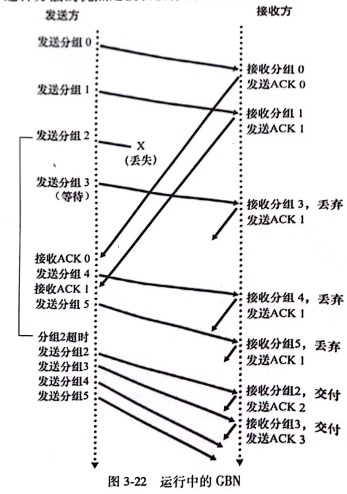
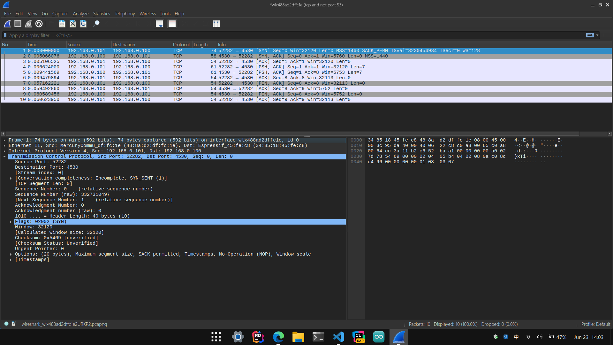

# 计算机网络

## 3. 运输层

### 3.4  可靠数据传输

有些时候，我们需要确保我们在因特网上交付的数据不被**打乱、丢失、损坏**，但网络层直接对我们提供的服务是**无链接、不可靠**的。
故而，如何在一个不可靠的传输服务上实现一个**可靠数据传输协议(RDT)**就成为了一个有价值的问题。

#### 3.4.1 构造RDT协议

首先，我们需要假设: 底层信道不会对分组进行重新排序，但某些分组可能会发生丢失。
随后我们来定义几个虚拟的接口：

```cpp
extern package make_pkt(uint8_t* data); // Make Package from user data
extern void udt_send(package pkg);      // Send package to lower layer
extern package udt_recv();              // Get package from lower layer
extern uint8_t* extract(package pkg);   // extract user data from package
```

1. 现在我们来思考第一种情况，假设我们调用的底层接口，也就是 **udt_send()和udt_recv()** 它们本身就是完全可靠的。

这是一种极其理想的情况，以至于我们无需额外考虑什么，而可以简单的将RDT协议定义为下面的样子:

```cpp
void rdt_send(uint8_t* data)
{
    package pkg = make_pkt(data);
    udt_send(pkg);
}
uint8_t* rdt_recv()
{
    package pkg = udt_recv();
    return extract(pkg);
}
```

在这种高度理想化的条件下，接收端无需反馈任何数据给发送端，因为数据的交付不会出现任何差错

2. 接下来我们要思考复杂一些的情况。假设我们的网络环境只会发生比特差错。

##### 自动重传请求协议(ARQ)

ARQ协议是一种建立在 **"肯定确认(ACK)"** 与 **"否定确认(NCK)"** 概念上的控制协议。其主要由三部分组成：

* 差错检测：使用类似与奇偶校验或海明码类的手段，实现检测数据在传输过程中是否出现了损坏。

* 接受方反馈：在传输可能会出现比特错误的情况下，我们需要一种机制，使得接受方在怀疑信息可能出现错误时，请求发送方重新发送。也就是发送 **ACK，NCK** 分组。

* 重传：接受方接受到有差错的分组时，会要求发送方重新发送。

为了实现ARQ协议，我们还需要定义几个虚拟的接口：

```cpp
extern bool isACK(package pkg); // Judge if the recived package is ACK
extern bool verifyPackage(package pkg); // Verify the recived package
```

然后我们这样定义rdt协议：

```cpp
void rdt_send(uint8_t* data)
{
    package pkg = make_pkt(data);
    udt_send(pkg);
    
    while(!isACK(pkg = udt_recv())) // Loop if recived NCK (1)
    {
        pkg = make_pkt(data);   // Resend package
        udt_send(pkg);
    }
}
uint8_t* rdt_recv()
{
    package pkg = udt_recv();
    while(!verifyPackage(pkg)) // Is the package crroupted?
    {
        package pkg = make_pkt(NAK); // Send NAK
        udt_send(pkg);
        pkg = udt_recv();
    }
    package pkg = make_pkt(ACK); // Send ACK and handle the package
    udt_send(pkg);
    return extract(pkg);
}
```

需要注意的是，在 **(1)** 处进行的循环使得整个系统在收到来自远程主机的回应(无论它是ACK还是NCK) 之前，不会进一步行动。并且，除非确认接收方已经正确地接收了数据，发送方不会继续发送新的数据。
由于这种行为，我们定义的新的RDT协议是一种 **停等协议(Stop-and-wait)**
RDT2.0 看起来已经可以运行了，但至少它还有一个致命的缺陷——没有考虑ACK或NCK分组受损的可能性。

现在考虑接受到损坏的ACK或NCK分组时，听起来可行的三种方法。

1. 发送方同样向接受方发送一个NCK分组，表示我没听清你在说什么。但如果这个NCK分组同样损坏了呢？这听起来像是在抬杠，但身为工程师，我们必须尽量去考虑最糟的情况。更何况在不稳定的网络环境中，发生连续的分组损坏并不是什么稀奇的事。
现在想象一下，如果接受方向发送方发送了一个ACK，而发送方没有正确接收到，并向接收方发送了一个NCK分组，而这个NCK分组同样损坏了。那么问题就来了——“接受方如何确认这是一个表示没听清我的ACK的NCK分组，还是一个损坏的新的数据分组”？再发送一个NCK分组吗？很显然，我们走上了一条困难重重的无穷证明之路。

2. 增加足够数量的检验和比特(比如我们熟悉的海明码)，使得双方不仅可以检验差错，还可以恢复差错。对于会产生差错但不会丢失分组的信道来说，这就可以解决问题。

3. 如果接收到了含糊不清的ACK或NCK分组，就直接重传当前分组。听起来不错，但是这可能为信道中带来 **冗余分组(duplicate packet)**，对于接收方来说，它不知道这个分组是一个新的数据分组，还是上个分组的重传。

解决这个问题的一种简单方法是让发送分组对其发送的数据编号，这样一来，如果接收方连续收到了编号相同的分组，很容易就能知道这是对于上一个分组的重传。
因为我们现在假设丢包不会发生，所以我们无需为ACK或NCK分组编号。

为了检查一个package的编号，我们需要额外定义一些虚拟接口：

```cpp
extern void AttachOrder(package *pkg, int order);
extern int GetOrder(package pkg); // Get order from package
extern int AllocOrder();    // Alloc a free order number
// We don't consider the situtation that the order number is overflow temporarily
extern void FreeOrder(int Order);    // Free a order number
// The returned order number will not be used at soon
```

然后我们重新定义我们的RDT协议：

```cpp
int GetReply() // Get a reply and return if it is ACK
{   
    // 0 : ACK, 1 : NCK, -1 : Unknown
    package pkg = udt_recv();
    if(!verifyPackage(pkg)) // Is the package crroupted?
    {
        return -1;
    }

    return isACK(pkg) ? 0 : 1;
}

void rdt_send(uint8_t* data)
{
    package pkg = make_pkt(data);
    int order = AllocOrder();

    AttachOrder(&pkg, order);
    udt_send(pkg);

    while(GetReply() != 0)
    {
        udt_send(pkg);
    }
    FreeOrder(order);
}

int last_order = -1;
uint8_t* rdt_recv()
{
    package pkg = udt_recv();
    while(!verifyPackage(pkg)) // Is the package crroupted?
    {
        package pkg = make_pkt(NAK); // Send NAK
        udt_send(pkg);
        pkg = udt_recv();
    }

    int local_order = -2;
    while((local_order = GetOrder(pkg)) == last_order) 
    // Package order is same with last package
    // which means the send havn't get out ACK
    // what should we do is resend ACK, and wait next package
    {
        package pkg = make_pkt(ACK); 
        // Send ACK
        udt_send(pkg);
        // Wait for next package
        pkg = udt_recv();
        while(!verifyPackage(pkg)) // Is the package crroupted?
        {
            package pkg = make_pkt(NAK); // Send NAK
            udt_send(pkg);
            pkg = udt_recv();
        }
    }

    package pkg = make_pkt(ACK); // Send ACK and handle the package
    udt_send(pkg);
    return extract(pkg);
}
```

3. 让我们进行更进一步的思考——如果我们的底层信道不仅会造成比特差错，还会丢包呢？

到现在为止，我们构建的RDT协议中已经包含了**检验、编号、应答、重传**等机制，而为了在可能丢包的环境下运行，我们必须面对两个新的问题：

* 如何检测丢包的发生
* 丢包后如何处理

为了解决他们，我们需要一些新的机制。

##### 超时机制

回忆一下，如果接收方收到了一个分组，无论如何，他都应该向发送方回复一些什么，不管是代表数据验证成功的ACK还是相反的NCK，总之他应该说些什么。
而对于发送方来说，**如果迟迟没有等到接受方的回复，其就有道理去怀疑丢包的发生**，而他只需要重传这个分组即可。
你可能会问：“万一分组并没有丢失，只不过接受方的回复来得迟了一些呢？”。其实这也无伤大雅，毕竟我们已经在前面的设计中添加了分组序号机制，这足以应对网络中的冗余分组。
相比这些，更重要的是：**发送方应该等多少时间合适？**

##### 计时器

若从发送方到接收方的延时为 $T_{d1}$，从接收方返回发送方的延时为 $T_{d2}$，接收方处理数据的时间为 $T_p$，则我们不难推理出发送方需要等待的最小时间为：

$$T_w=T_{d1}+T_{d2}+T_p$$

然而在此之上，一个网络中数据包往返所需的最大时间是难以计算的。对于我们先前提出的策略：**如果迟迟没有等到接受方的回复，其就有道理去怀疑丢包的发生，而他只需要重传这个分组即可**，如果我们等待的时间过长，会导致协议长时间在等待状态中无法回复。而如果等待的时间过短，则会导致协议向信道中引入大量的冗余分组，同样浪费性能。

##### 一个看起来可以运行的RDT协议

我们假设我们已经有了一个合理的超时时间，并废弃函数 **udt_send()和udt_recv()**，用一个文件接口 **extern int dc;** 代替。

```cpp
extern int dc; // Data channel
extern int tc; // Timer channel
extern void startTimer();
extern void stopTimer();

extern package readfrom(int fd);
```

调用 **startTimer()** 后，计时器开始计时，此后每次触发定时器事件，程序都能从tc端口读出一个字节。

```cpp
// the rdt_recv() fnunction is same as last
// we use io-multiplexing to simplify code
void rdt_send(uint8_t *data)
{
    // clear rx
    flush(dc);

    package pkg = make_pkt(data);
    int order = AllocOrder();

    AttachOrder(&pkg, order);
    udt_send(pkg);
    startTimer();

    epoll_event ev_timer[2] = {};
    ev_timer[0].events = EPOLLIN;
    ev_timer[0].data.fd = dc;   // Data Channel

    ev_timer[1].events = EPOLLIN;
    ev_timer[1].data.fd = tc;   // Timer Channel

    epoll_ctl(ed, EPOLL_CTL_ADD, dc, &ev_timer[0]);
    epoll_ctl(ed, EPOLL_CTL_ADD, tc, &ev_timer[1]);

    epoll_event revents[2];

    while(1)
    {
        int n = epoll_wait(ed, revents, 2, 1000);
        for(int i=0;i<n;i++)
        {
            int fd = revents[i].data.fd;
            if(fd == tc)    // Time Channel
            {
                udt_send(pkg);
            }
            else if(fd == dc)  // Data Channel
            {
                package pkg = readfrom(dc);
                if(!verifyPackage(pkg) && isACK(pkg)) // Is the package crroupted?
                    break;
                else
                    udt_send(pkg);  // Resend
            }
        }
    }

    FreeOrder(order);
    stopTimer();
}
```

值得注意的是，若延迟过早，导致发送方在信道中引入了冗余分组，则发送方也会收到多余的ACK，对于这种情况，我们只需要一种极为简单的策略——不必管他。


至此，我们终于得到了一个可以运行的可靠数据传输协议。

#### 3.4.2 流水线可靠数据传输协议

##### 速率与时延与吞吐量

在现实中(比如玩MOBA游戏)，我们经常会主观地将 **"网速** 与 **"延迟"** 联系起来，认为网速越快延迟越小。但其实这并不完全正确，接下来我们将会从理性而专业的角度说明这一点。

##### 时延

从源主机开始发送一个分组开始，到目的主机完整地接收这个分组的时间称为**时延**，在一条通讯链路中，会引入时延的因素主要有以下几种：

* 处理时延

你的网络适配器将字节流转换为以太网电平信号的时间、交换机检查ETH头决定转发方向的时间，路由器检查分组中比特差错的时间——这些都属于处理时延。

* 排队时延

简单来说，就是一个分组在通讯链路的门口等待被传输的时延。如果你问它需要等多长时间，这取决与有多少个分组先于它到达，并且还没有被传输。如果它是第一个到达的，也没有正在传输的分组，那么排队时延就为0。

* 传输时延

传输时延是指一个分组从开始，到完整地被推向一个通讯链路的时延，它取决于链路的速率，以及分组的长度。
现在来思考两个问题吧，第一个：

**如果端口A把一个分组推向链路用了5ms，端口B从链路接收一个分组需要5ms，电信号可以从一个端口瞬间飞到另一个端口(没错，超光速)，那么这段链路的传输时延是？**

很简单，5ms。想不明白立即推——放弃考研。

第二个问题：

**假设我向ISP购买了100M的宽带线路，这个"100M"是指哪条通讯链路的速率是100Mbps？假设你正在观看某 www.p\*o\*h\*b.com 网站的视频，你的宽带是100M宽带。这是指从你的PC到p站服务器的链路的速率最高为100Mbps吗？**

那显然不是这里我们权且用b站代替p站做一个实验：


通过上面的命令，我们可以知道 www.bilibili.com 服务器的IP地址为 47.103.24.173

现在让我们用traceroute命令看一看我们的分组是怎么到达b站的(只截出一部分)：


首先，分组到达了本地局域网的网关：192.168.3.1，经过NAT后，分组被转发至上一层局域网的网关：119.49.80.1，再经过一层NAT后，分组被转发到 218.27.131.105 这可能是更高一级的路由器，再经过若干次转发后，分组被转发到了b站服务器机房的WAN接口上，然后被交付给某台服务器。

然后话说回来了，这100M宽带，到底是这条链路中的哪部份的速度为100Mbps呢？不如我们用排除法吧。
首先，肯定不是从你的网卡到路由器的速率(除非你的宽带合约规定了你的ISP要为你购买电脑)。然后也不是从ISP到他之后的某台中间路由器的速率(实际上这个速率高到你难以想象)，也不是从b站的外网路由器到某台服务器的速率(b站的服务器又不是电信联通给他买的)，那么答案看起来只剩下一个了——**100Mbps是从你的本地路由器到ISP的链路速率**

或许你会说：“我家的路由器是千兆路由器啊”。呃，首先，以太网的端口之间会自动协调匹配使用的传输速率。即使一个端口的最高传输速率是1Gbps，当它与一个1Kbps的端口通讯时，也会自动把速度匹配至1Kbps

其次，即使考虑一种极端的情况。你的PC不管ISP为你提供的带宽是多少，任性地以1Gbps的速度向网络中丢数据包——你可以这样做，毕竟你的路由器是千兆的。但这不意味着这些分组会以1Gbps的速度被发送至ISP，事实上他们会堆积在路由器中，如果路由器的缓存满了，就会发生丢包。

* 传播时延

如果你用超声波调制网络信号，那么你的传播时延大概就是 $\frac{Lp}{340 m \cdot s^{-1}}$，式中 $L_p$ 是链路的物理长度。如果你用光纤传递信号，就把340换成光速。很好理解吧？

##### 吞吐量

现在问题来了，我们讨论了各种时延以及链路的速度。那么到底是什么决定了你的网速呢？我们直接把答案摆出来：**从你的PC到服务器之间的通讯链路中，传输速率最低的一条链路决定了你的网速，这个数值同时也是这条通讯链路的吞吐量**，这通常来说就是从你的PC到ISP的速度。
通常来说，越靠近因特网主干线的通讯链路，其速度就越快，否则就会造成大量的丢包以及缓冲区溢出。

现在再来看一看，为什么“网速越快，延迟越小”这个说法不完全正确。网速是指一条通讯链路的吞吐量，但这只确定了这条通讯链路中的传输延迟。即使你可以向网络中以极快的速度传输数据，你的数据也有可能要在路由器中排半天队，或是在电线或大气层中慢慢地飞。

举一个现实中的例子，我用一根水管，以 $10m^3\cdot s^{-1}$ 的速率从北京向沈阳运输自来水。再以相同粗细的水管，以 $100m^3 \cdot s^{-1}$ 的速率向火星运输自来水。如果论运输自来水的速率的话，显然到火星的线路更胜一筹。但如果论时延，恐怕北京那边都喝上好几年水了，火星还连水的影子都没看到。

##### 我们构建的RDT协议的缺陷

经过上面的讨论，我们可以很容易地看出我们构建的协议存在一个很大的缺陷——**链路时延会直接影响协议的吞吐量**。

现在假设我们的协议工作在一条1Gbps的通讯链路上，链路的处理时延、排队时延和传播时延总和为10ms，并且不会发生比特差错和丢包。发送方每次发送长度为1024 Byte的分组，接受方返回1bit的分组作为确认。

在这种情况下，发送方的传输时延为 $\frac{1024 \cdot 8 \cdot 10^{6}}{2^{30}} = 7.63us$，接收方的传输时延几乎可以忽略不计。
一个发送接收周期的总时间为 $10ms + 10ms + 7.63us$ 这几乎就是20ms，换句话说，我们仅仅让一条1Gbps的链路发挥出了400 Kbps的速率，这是难以接受的。

这种性能问题的一个简单的解决方法就是：Give up停等协议，让发送方可以在接收方确认之前发送多个数据分组，这种技术被称为流水线传输。


#### 3.4.3 回退N步(GBN)协议

##### 循环序号

在GBN协议中，序号是被循环使用的，这意味着在比较首部和尾部的序号时，不能做简单的数值比较。

* 基序号：正在投入使用的，最小(先被使用为小)的序号。
* 窗口长度：协议中最多可存在的，未确认的分组数。

##### 发送方的行为

1. 响应上层的调用
2. 响应ACK

在GBN协议中，ACK分组同样是带编号的。n号ACK表示n号数据分组，**以及他之前的数据分组都已经正确传输**，等等，前面我懂，但是为什么他之前的分组也能确定得到了正确的传输呢？我们马上就会说到。

3. 超时处理

GBN协议对分组超时的处理方式也是它名字的来源，即 **"回退N步"**，当一个分组丢失时，发送方会重传这个分组，以及所有序号大于它的分组。你可能觉得这有些浪费(没错就是这样)。发送方的这种重传策略与接收端的处理策略有关。

##### 接收方的行为

1. 响应数据分组

当接收者完整正确地收到一个分组时，根据分组的编号，向发送者回复ACK分组。若收到分组n，则回复ACKn

2. 失序处理

GBN协议中，接收方会丢弃所有失序分组，并且向发送方回复最后一次成功接收的ACK分组。



#### 3.4.4 选择重发(SR)

我们很容易就能察觉到，GBN协议中存在着一个致命的缺陷。如果窗口长度很大，或者信道时延很大，将会让GBN协议在信道中引入大量的冗余分组。
于此相对的，SR协议可以让发送方仅重传那些他怀疑接收方没有正确接收的分组，从而避免了不必要的重传。


与GBN协议不同的是，当接收到一个失序分组时，SR协议不会直接将其丢弃，而是会将其缓存，直到比他序号更小的分组都被正确的接收。

(SR协议的发送方和接收方行为不想手打了，看截图吧)


#### 必须注意的一点

在SR协议中，可用序号的宽度都必须至少是窗口长度的两倍。
很简单，假如我们的序号池是 $\{0,1,2,3\}$，窗口长度为3。发送方向接收方连续发送3,0,1号分组，3号分组丢失，0号先到达。
此时如果发送方重传3号分组，接收方要如何确定这是一个新的分组还是一次重传？无法确定。

### 3.5 面向链接的传输: TCP

#### 3.5.1 TCP链接

TCP链接是一种逻辑连接，物理世界中并不存在这么一根“线”，把服务端和客户端连在一起。甚至连接路径上的交换机和路由器也看不见这个“连接”，他们只看得见分组。
说到底，TCP链接是指 **通信的双方在正式交互数据前发送的预备报文段，以建立确保数据传输的参数**，这个过程常常被成为**握手**

##### 需要补充的信息

在TCP规范 $[RFC 793]$ 中并没有提及TCP协议应该在何时取出TxBuffer中的数据，只说了他应该在"方便"的时候发送他们。
并且，TCP可以一次从TxBuffer中取出，并装入报文段中的数据量是有限制的，取决于最大报文段长度。这同时也意味着TCP并不保证按照用户装入的分组格式传输数据，**TCP是面向数据流的协议，而不是数据分组**，如果你要求TCP发送两个512Byte的数据，TCP可能会把他们合为一个1KByte数据去发送。在接受端也不会把它们拆开。

通过上面的讨论，我们知道了TCP链接至少应该包含这些东西：

* 两台主机上的缓存、变量、与进程链接的套接字

而在这两台主机之间的网路元素，如**交换机、路由器，并没有为一个TCP链接维护任何东西**

#### 3.5.2 TCP报文段结构

下面的图片展示了TCP报文段的结构


如果写成代码的形式就是这样：

```cpp
struct tcphdr {
    uint16_t source;       // 源端口号
    uint16_t dest;         // 目的端口号
    uint32_t seq;          // 序列号
    uint32_t ack_seq;      // 确认序列号
#if __BYTE_ORDER == __LITTLE_ENDIAN
    uint16_t res1:4;       // 保留位
    uint16_t doff:4;       // 数据偏移
    uint16_t fin:1;        // FIN标志
    uint16_t syn:1;        // SYN标志
    uint16_t rst:1;        // RST标志
    uint16_t psh:1;        // PSH标志
    uint16_t ack:1;        // ACK标志
    uint16_t urg:1;        // URG标志
    uint16_t res2:2;       // 保留位
#elif __BYTE_ORDER == __BIG_ENDIAN
    uint16_t doff:4;       // 数据偏移
    uint16_t res1:4;       // 保留位
    uint16_t res2:2;       // 保留位
    uint16_t urg:1;        // URG标志
    uint16_t ack:1;        // ACK标志
    uint16_t psh:1;        // PSH标志
    uint16_t rst:1;        // RST标志
    uint16_t syn:1;        // SYN标志
    uint16_t fin:1;        // FIN标志
#endif
    uint16_t window;       // 窗口大小
    uint16_t check;        // 校验和
    uint16_t urg_ptr;      // 紧急指针
};

```

经过前面对于RDT协议的讨论，我们应该已经很容易猜出序号的确认号的意义，源端口号和目的端口号的讨论，也在IO多路复用的部分讨论过。

* 接收窗口字段：接受方愿意接收的字节数量，用于流量控制
* 首部长度字段：指示TCP头部的长度，这意味着TCP头的可变长度的
* 标志字段：指示该条报文应如何解读
* 因特网校验字段：用于检测比特错误

##### 序号和确认号

我们前面已经说过，TCP是面向数据流的协议，而不是面向数据分组的。他把数据看成是一个有顺序的，无结构的字节流。
故而，TCP的编号也是对字节编号，而不是对分组。
假设我们有3000 Byte的数据要通过TCP协议发送，MSS(最大报文长度)为1100。而TCP协议决定每次发送1000个字节，分三次发送。
那么第一个TCP分组的Seq字段就为0，第二个为1000，第三个为2000。没错，Seq字段不是对分组的编号，而是报文中首个数据字节的编号。

对于确认(ACK)号的讨论会略显复杂，为了实现重传和全双工，TCP协议填入ACK序号中的数值，是**一个主机期待从另一个主机接受到的下一个字节的字节号**

若主机A已经收到来自主机B的，包含字节0～535的报文段，以及另一个包含字节900～1000的报文段。
此时，为了重建正确的字节序，协议会先缓存900～1000字节，然后向另一端发送包含确认号536的报文段，这是该流中第一个可能丢失的字节，所以，TCP也被成为提供 **累积确认**

#### 3.5.6 TCP连接管理

我们不妨通过实验来了解所谓的“三次握手”和“四次挥手”。为此，我们编写了一对示例客户端/服务端，他们的功能很简单——服务端无论收到什么都原封不动地发回给客户端。



这是一次完整的TCP通讯的抓包记录，我们可以从中看到TCP连接建立的三次握手，应用层数据的传输，还有连接结束的四次挥手。

##### 三次握手

* 第一阶段：客户端向服务端发送 **SYN报文段**


此条报文不包括应用层数据，并且 **SYN** 标志被置为1。此外，客户端随机地选择了一个初始序号，在这次通讯中，这个初始序号(client_isn)为 “3327310497”。

* 第二阶段：若服务端接收到了SYN报文


首先，服务端为这条TCP连接分配相应的缓存和变量。然后向客户端返回一条**SYN ACK报文**，这意味着服务端收到了连接请求并且允许连接。
这条报文依旧不包含应用层数据，并且SYN和ACK标志都被置1。此外，服务器也选择了自己的初始序号(server_isn)：4125905062，并将 Acknowledge Number设置为client_isn+1。这表示服务端确认了客户端发来的初始序号，并期望下一次从服务端接收到序号为client_isn+1的数据。

* 第三阶段：客户端确认连接请求


当客户端确认服务端已经为建立这条链接做好准备时，它也会为这条链接分配相应的缓存和变量。因为连接已经建立了，所以SYN标志被置0。此外，客户端将 Acknowledge Number设置为server_isn+1，这表示客户端收到了服务端发来的序号为server_isn的分组，下一次期待从服务端收到序号为server_isn+1的分组。

###### TCP连接建立的总体过程

1. Client === SYN ===> Server
2. Client <= SYN ACK = Server
3. Client === ACK ===> Server

##### 应用层数据的传输

首先，回想一下我们设计的应用程序的功能。服务端无论收到什么(应用层数据)，都原封不动地回传给客户端。

* 客户端向服务端发送数据


在这一段报文中，**PSH标志**被置为1，这代表此段报文包含应用层数据，并且接受段应该立刻将此段报文的数据交付到上层。并且seq_num=1，这是服务端期待收到的下一个字节，用户层数据长度为7。

* 服务端回传数据，并确认客户端发来的数据


* 客户端确认服务端数据


##### 四次挥手

与建立一个TCP链接不同，断开一条TCP连接的过程可以由任意一方发起，而断开连接的操作，或者说“四次挥手”的起点，是一条特殊的TCP报文。


在客户端发送的这条报文中，FIN标志被置为1。这说明客户端希望中止该条TCP连接，当服务端收到后，会回传一个ACK报文，并开始释放相关的资源。


当资源释放结束后，服务端向客户端发送一条FIN报文，说明自己的资源已经释放。


最后，客户端响应这条报文。至此，TCP连接断开。


## 4. 网络层

