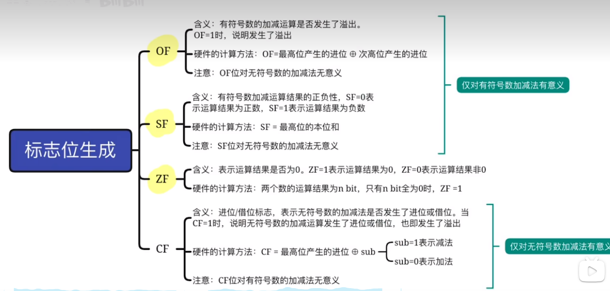

 
# 计算机组成

## 性能指标


## Bin Coded Dec(BCD码)


## 无符号整数的运算


## 带符号整数的表示

### 原码

其实就是第一位表示符号，后面表示原数。顺带一提，这种方式不常用的原因并不是比补码少了那一个数的表示范围，而是符号位不能参与运算，从而使运算电路变复杂。

### 补码

与原码的区别是，当符号位为1时，其要表示的数是数值位取反再+1。
**原码和补码之间相互转换的规则是相同的，都是取反码再+1，如果你想求一个intx_t的相反数，就连带着符号为一起取反码，再+1**

### 移码

将补码的符号位反转

定义如下


## 定点小数

与定点整数的区别是，在扩展位数时补0的位置不同。实际上是对同一个二进制串的不同解释。

$0.x_1 x_2 x_3 x_4 x_5 x_6 x_7 \to 0.x_1 \cdot 2^{-1} + x_2 \cdot 2^{-2} ...$

小数点前面的是符号位

# 算术逻辑单元(ALU)

## 码运算





## 原码的乘法运算


```cpp
uint32_t quick_mul(uint32_t x, uint32_t y)
{
    uint64_t r = y;
    for(uint8_t i=0;i<32;i++)
    {
        if(r & 1)
            *((uint32_t*)&r + 1) += x;
        r = r>>1;
    }
    return r;
}
```

## 补码的乘法运算 (Booth算法)


## 除法运算


## 浮点数的规格化

* 若浮点数的尾数的最高位是无效值，则会损失精度


对于原码，尾数的最高位必须是1。对于补码，正数与原码相同。负数的补码的最高位必须是有效位0。


## IEEE

我来告诉你为什么IEEE的阶码不能直接把符号位取反求移码。因为IEEE规定的移码偏置值不是$2^{n-1}$，对于8位阶码，他是127。

* float   1+8+23   偏置：127
* double  1+11+52  偏置：1023
* ldouble 1+15+64  偏置：16383


# 存储器

## 存储器的层次化结构


## DRAM(主存)的原理

(合着RAM真就是每个存储单元配译码器的一根线呗)


## DRAM和SRAM

* SRAM: 以双稳态触发器构成，造价高，速度快，用于CPU高速缓存
* DRAM: 以栅极电容电力构成，造价低，容量大，用于主存

## 提高主存速度的方法


## HHD与SSD

### HHD

* 磁头数: 又称盘面数。实际上，有多少盘面，就有多少磁头
* 柱面数: 又称磁道数。在盘面上，磁性物质不是一整块平铺的，而是环形的分布。每一个磁性物质环就被称为一个磁道。
* 扇区数: 表示每一条磁道被划分为多少个扇区。

HHD由三部分组成：磁盘驱动器(机械结构)、磁盘控制器(主控)、盘片
主控对外提供的接口有三种比较常见：SATA、IDE、SCSI


### SSD

其本质上属于一种EEPROM(电可擦除只读存储器)，由**闪存翻译层**和**存储介质**组成。

闪存翻译层: 将存储介质内的离散页组织为连续的逻辑页，并维护他们之间的映射关系。
存储介质: 多为Flash芯片。

SSD以**页**为基本读写单位，对标磁盘的扇区。每个页只可以进行一次写入操作，若需要重复修改数据，则需要进行**擦除**操作。
需要注意的是，SSD以**块**为擦除的基本单位。进行擦除后的块，其中的每个页都可以写入一次。

SSD的随机访问性能远远高于HHD，因为SSD通过电路寻址，而不需要移动磁头去寻找柱面。


## Cache

### CPU与外设之间速度的矛盾

在计算机发展的过程中，各个组件运行频率的增速各不相同。CPU的增速最高，其次是主存，再其次是硬盘。
对于CPU来说，现代的CPU可以达到4GHz以上的主频，内存则要慢一些。
我们知道指令代码是在主存中等待被CPU执行的，如果CPU没执行一条指令都要访问一次主存，显然CPU的运行速度就被钳位在了主存的速度上。即使你的CPU运行的飞快——那也没用，你得等待主存把指令代码交给你才能做任何事。
甚至，对于硬盘来说，如果CPU每当向硬盘发出一个IO指令，都要等待这个指令完成再去做其他的事，那CPU几乎所有的时间就都用来等待硬盘响应了，这显然是极度不合理的。
为了解决后者，计算机发展出了**中断**技术，而为了解决前者，**Cache**技术应运而生。

### 局部性

在解决上述问题的过程中，科学家们找到了一个不错的入口点。即——我们交给计算机运行的程序通常是有逻辑的(**没有逻辑的代码有什么意义呢**)。
CPU并不是从茫茫的内存之海中随机地挑选一条去执行，与此相反，如果一块内存被访问，那么在近期，与它临近的区域有相当大的概率被访问。
这很容易理解，代码在大部分时刻都是顺序执行，或短距离跳转的。长距离的跳转虽然也经常发生，但如果与顺序执行的代码数量相比，他们只占很少一部分。这意味着，**若一条代码被从主存中取出准备执行，与它的地址邻近的代码有极大的概率被执行。**
然而不只是代码，大部分数据也是以顺序结构存储的，**若主存中的一块数据被调用，与它的地址邻近的数据也有极大的概率被执行。**

* 以上两条表述可以被总结为**程序的空间局部性。**

此外，由于程序中的堆栈以及循环结构，**若主存中的一块数据被调用，在近期它极有可能被再次调用。**

* 这被称为**程序的时间局部性**

### 存储器磁的层次

* L0: 寄存器，与CPU同频率运行 (保存着从高速缓存中取出的字)
* L1: 高速缓存，保存从L2中取出的数据
* L2: 高速缓存，保存从L3中取出的数据
* L3: 高速缓存，保存从主存中取出的数据
* L4: 主存(DRAM)，保存从磁盘中取出的数据
* L5: 本地二级储存，保存从远程主机中取出的数据
* L6: 远程主机(远程二级储存)

该层次越靠上，运行频率越高，造价越高。越靠下，运行频率越低，速度越慢，造价越低。
计算机靠把下层的数据缓存至上层提高CPU访问它们的速率，直到最小的缓存——CPU寄存器。

* 若程序需要一块数据，并在 $k$ 层找到了它，这被称为 **缓存命中**
* 若在 $k$ 层没有找到，则程序必须去 $k+1$ 层去寻找它需要的数据，这被称为 **缓存不命中**

### Cache和主存的映射方式

#### 全相联映射

* 主存块可以放到Cache的任意位置

为了完整地保存Cache和主存的映射信息，我们首先需要一个**标志量**，用于记录该Cache块对应着哪个地址的内存块。还需要一个**有效位**，用于记录该Cache块中是否保存了有效的信息。
计算机系统以 **Cache行(Cache块)** 为单位管理Cache和内存之间的交换。要注意，这里的Cache块与内存分页管理机制中的**内存页**并不是同一个概念。


#### 直接映射

* 相当于把Cache在内存中平铺

 

主存地址 $A$ 可以被加载到的Cahce地址 $B$ 为:

$$B = A \% len(Cache)$$

需要注意的是，对于直接映射方式，标志量无需保存对应的主存的完整地址——因为只有部分主存可以被保存到同一个地址。
若定义Cache行的大小为 $64Byte$ ，主存地址空间大小为 $256MByte$，Cache内有8个Cache行。
总结一下，我们有6位Cache，28位主存，主存块/Cache块的大小也为6位。
由此我们可以推理出，主存地址的低6位为块内地址(把一个uint28分成若干份uint6，高22位为第n份，低6位为在这一份内的哪个地方，不懂去重修小学数学)。
而由于地址每增加8($2^3$)，就会回到原先的Cache地址，故而能保存到同一个Cache地址的主存，其地址后三位是相同的。
综上所述，直接映射模式下，标记量位数可以这样计算:


$$F_b=M_b-log_2(\frac{C_l}{C_c})$$

式中 $M_b$ 为内存位数， $C_l$为Cache行长， $C_c$为Cache行数。

#### 组相联映射

* 缝合了前两种方式，相当于把Cache先分组，然后在主存中平铺。


### Cache的替换策略

当Cache被装满时，我们需要考虑：若此时还有一个新的内存块需要被装进Cache，我们要把哪个Cache牺牲掉。对此，科学家们设计出了若干中算法，而以下四种比较流行：

* 随机算法(RAND)
* 先进先出算法(FIFO)
* 近期最少使用(LRU)
* 最近最不经常使用(LFU)

#### 随机算法(RAND)

最Free的算法。


#### 先进先出(FIFO)


FIFO算法最核心的问题是依然没考虑到局部性的问题，一个块被最先调用，并不代表他在未来的一段时间内不会再被调用。

#### 近期最少使用(LRU)

核心思想是给每个Cache行分配一个计数器，而策略如下：


你可能会想，为什么在Cache命中时，只把比其低的计数器+1,而不是除了他之外的计数器全部+1。
这是为了限制计数器的最大值，如果在命中时把除了被命中的Cache行之外的计数器全部+1，可能会导致计数器无限制地增长。
想象一下，如果我疯狂地访问一个Cache行，其他行的计数器会持续增加，但又没有新的行加入。而采用只把比其低的计数器+1这种策略的话，计数器的位数只需要大于 $log_2(行数)$。
这种算法很好地遵循了局部性原则，实际运行的效果最好。

#### 最近最不经常使用(LFU)


### Cache的写策略


## 页式储存

正如我们前面提到过的三种缓存映射方式：**全相联映射、直接映射和组相联映射**，是从主存到Cache的缓存管理机制，主存与比主存低一级的存储介质——磁盘之间，也存在一种缓存机制：**分页机制**。

**(转操作系统)**


******

## 指令系统


### 指令编码概述

#### 几个重要的寄存器

* %rax 储存函数返回值
* %rdi, %rsi, %rdx, %rcx, %r8, %r9 分别保存第 1-6个参数
* %rsp 栈指针, %rbp 栈底指针
* %rip 程序计数器
* CF: 进位标志
* ZF: 零标志
* SF: 符号标志
* OF: 溢出标志

#### 指令格式

##### 零地址指令

* 无需操作数，如nop、halt等
* 操作数隐藏在某些寄存器或堆栈中(后文简称"其他地方")

##### 单地址指令

* 只需要一个操作数(类比一元运算符)，如取反、取补、自增自减
* 某些操作数隐含在其他地方

##### 双地址指令

* 需要两个操作数(类比二元运算符)，如加减乘除、与或

**补充: 完成一次二元指令需要四次访存操作，例如：**
**mul (%rbx), (%rcx)**
需要经历以下流程:
取指令->读取(%rbx)->读取(%rcx)->写(%rbx)

##### 三地址指令

* 在双地址指令的基础上，把结果存储在另外的地方

**例如: mul (%rbx), (%rcx), (%rdx)，会执行操作：(%rbx) \cdot (%rcx) -> (%rdx)**

##### 四地址指令 (别把指令编码想得这么简单......)


#### 扩展操作码

要知道，在CPU眼中，所谓的指令不过是长长的字节串。并且一个n位的CPU同时只能看见它面前的n位，在这种情况下，如何保证CPU能正确地理解一个指令，而不出现歧义呢？

考虑以下的情况：

我们有一个8位的CPU，可变长度的操作码，现在这个CPU面对下面的两条指令：

0x11, 0x22 // 假设0x11对应的操作码是把后面跟着的操作数所指向的主存地址的内容自增1
0xFF, 0x01, 0x22 // 假设0x01FF对应的操作码是把后面跟着的操作数所指向的主存地址的内容自减1

在这种情况下，我们如何保证CPU在理解第二条指令时，不会把他理解为8位指令0xFF搭配上操作数0x01，而是16位指令0x01FF搭配上操作数0x22

答案是：为8位指令预留一个0xFF字节，使0xFF无法单独构成一个指令

**(此部分详见哈夫曼编码)**


#### 指令寻址


#### 数据访问概述

对于(提供给CPU的)指令来说，能直接访问的数据主要分为三种：

* 立即数
* 寄存器
* 主存

并衍生出以下若干种寻址格式

| Type | Format | Operation value | Name |
|-------|-------|-------|-------|
| 立即数 | $\$Imm$ | $Imm$ | 立即数寻址 |
| 寄存器 | $r_a$  | $R(r_a)$ | 寄存器寻址 |
| 存储器 | $Imm$ | $M(Imm)$ | 绝对寻址 |
| 存储器 | $(r_a)$  | $M[R(r_a))]$ | 间接寻址 |
| 存储器 | $Imm(r_b)$  | $M[Imm+R(r_b)]$ | 基址+偏移 |
| 存储器 | $(r_b,r_i)$  | $M[R(r_b)+R(r_i)]$ | 变址寻址 |
| 存储器 | $Imm(r_b,r_i)$  | $M[Imm+R(r_b)+R(r_i)]$ | 变址寻址 |
| 存储器 | $(,r_i,s)$  | $M[R(r_i) \cdot s]$ | 比例变址寻址 |
| 存储器 | $Imm(,r_i,s)$  | $M[Imm+R(r_i) \cdot s]$ | 比例变址寻址 |
| 存储器 | $(r_b,r_i,s)$  | $M[R(r_b)+R(r_i) \cdot s]$ | 比例变址寻址 |
| 存储器 | $Imm(r_b,r_i,s)$  | $M[Imm+R(r_b)+R(r_i) \cdot s]$ | 比例变址寻址 |

##### 立即数寻址

顾名思义，这种寻址方式代表指令提供的数据本身就是指令的操作数。无需取寄存器，也无需读主存。

##### 寄存器寻址

表示指令的操作数需要到指定的寄存器中去寻找。

##### 绝对寻址

表示指令的操作数要去指定的主存地址中寻找，该地址由立即数直接提供

##### 间接寻址

表示指令的操作数要去指定的主存地址中寻找，该地址由一个寄存器(或另一个主存地址)提供。
需要指出的是，x86架构不支持直接的二阶间接寻址，你需要先把对应的地址读取到寄存器中，例如下面的代码：

```c
uint32_t add(uint32_t *x, uint32_t *y)
{
    return *x + *y;
}
```

可以被编译为:

```asm
sub $0x8,%esp   ;分配8字节的函数栈
;我们假设函数使用堆栈传参数，且机器字长为32bit
mov -16(%esp),%eax  ;取得参数一到寄存器eax
mov -12(%esp),%ebx  ;取得参数二到寄存器ebx
;参数为指向操作数的指针
mov (%eax),%ecx     ;取eax处的主存数据
mov (%ebx),%edx     ;去ebx处的主存数据
add %ecx,edx
mov %edx,%eax       ;返回值保存于eax 
add $0x8,%esp   ;销毁函数栈
ret
```

##### 基址+偏移

在上面的代码中

```asm
mov -16(%esp),%eax  ;取得参数一到寄存器eax
mov -12(%esp),%ebx  ;取得参数二到寄存器ebx
```

两行使用的就是基址+偏移寻址，因为我们要的参数保存在栈顶下的-16字节和-12字节处，所以我们引用寄存器esp，再加上一个偏移量，实现偏移寻址。

##### 变址寻址

我愿称其为“基址+偏移plus版”，只不过基址和偏移都存在寄存器里面

##### 比例变址寻址

访问数组时需要使用的寻址方式

```c
uint32_t sum(uint32_t *array, uint32_t len)
{
    uint32_t r = 0;
    for(uint32_t i=0;i!=len;i++)
    {
        r+=array[i];
    }
    return r;
}
```

该代码可以被编译为

```asm
    xor %eax,%eax   ;把eax置零
    xor %ebx,%ebx   ;把ebx置零
.BEGIN
    cmp %ebx,%esi   ;比较ebx与第二个参数
    jz .END
    add %eax,(%edi,%ebx,4)  ;把%edi+%ebx*4处的数据与eax相加，结果保存于eax
    add $1,%ebx
    jmp .BEGIN
.END:
    ret
```

##### 408Plus


### 汇编语言纵览

## CPU


### 控制器(CU)


#### 程序计数器(PC)

PC始终指向CPU要执行的下一条指令。因为指令通常是按顺序执行的，所以PC有自增功能。

#### 指令寄存器(IR)

保存着当前正在执行的指令

#### 指令译码器(ID)

仅对操作码字符进行译码

#### 微操作信号发生器(MSG)

根据IR中的内容，以及PSW(标志寄存器)中的内容，及时序信号，产生控制整个计算机系统的控制信号。

#### 时序系统(TS)

产生各种CLOCK信号，由硬件时钟分频得到

#### 存储器地址寄存器(MAR)

保存要访问的主存单元的地址

#### 存储器数据寄存器(MDR)

保存与主存单元交换的信息

### 指令周期流程

* 取指令周期
* 间址周期
* 执行周期
* 中断周期

#### 取指令周期(FE)

从主存中取出指令

#### 间址周期(IND)

若指令中存在间接取址操作，CPU会在该周期内通过若干操作计算出操作数的有效地址，有可能会进行读主存操作

#### 执行周期(EX)

CPU按照指令的要求进行相应的操作，有可能因操作数保存于主存中而产生读主存操作

#### 中断周期(INT)

CPU检查是否有外部中断事件到来，若有则需要中断当前流水线，转而执行中断服务程序


### 数据通路


#### 寄存器-寄存器数据传送

以把指令地址传送至MAR寄存器为例

| 操作 | 有效信号 | 
|-------|-------|
| PC->Bus->MAR | PCout, MARin |
| AX->Bus->BX | AXout, BXin |

#### 寄存器-主存数据传送

以从主存读取指令为例

| 操作 | 有效信号 | 
|-------|-------| 
| PC->Bus->MAR | PCout, MARin |
| 1->R |  |
| MEM(MAR)->MDR | MDRinE |
| MDR->IR | MDRout, IRin |

#### 例题

设有如图所示的单总线结构，分析指令ADD (R0), R1的指令流程和控制信号


取指令周期：
| 操作 | 有效信号 | 
|-------|-------| 
|PC->MAR|PCout, MARin|
|1->R||
|MEM(MAR)->MDR|MARout, MDRinE|
|MDR->IR|IRin, MDRout|
|指令译码||
|PC+1->PC||

执行周期：

| 操作 | 有效信号 | 
|-------|-------| 
|R0->Bus->MAR|R0out, MARin|
|1->R||
|MEM(MAR)->MDR|MARout, MDRinE|
|MDR->Bus->Y|Yin, MDRout|
|R1+Y->Z|R1out, ALUin, ALU加指令|
|Z->Bus->R1|Zout, R1in|

#### 例题2


(1) a: MDR b: MAR c:IR d:PC
(2) 

| 操作 | 有效信号 | 
|-------|-------| 
|PC->MAR||
|MEM(MAR)->MDR||
|MDR->IR||
|PC+1->PC||

### 硬布线控制器

#### 微命令与微操作

CPU发出一个微命令，可以完成对应的微操作。
总的来说，**微命令与微操作是组成CPU用户指令的更基本的CPU行为**

#### 机器周期

* 取址周期(FE)
* 间址周期(IND)
* 执行周期(EX)
* 中断周期(INT)

在硬布线控制器中，我们通常采用定长的机器周期。也就是说，每个机器周期所对应的晶振周期数是相同的。<br>
一个**晶振周期**又称为一个**节拍**

#### 操作码译码器

把 n位指令操作码转化为 $2^n$ 根线的译码器。


#### 硬布线三原则

1. 微操作的**先后顺序**不得随意更改
2. **被控对象不同**的微操作，尽量在一个节拍内完成。
3. 占用时间较短的微操作，尽量安排在一个节拍内完成，并允许有先后顺序

### 微程序控制器

#### 


