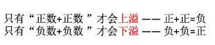
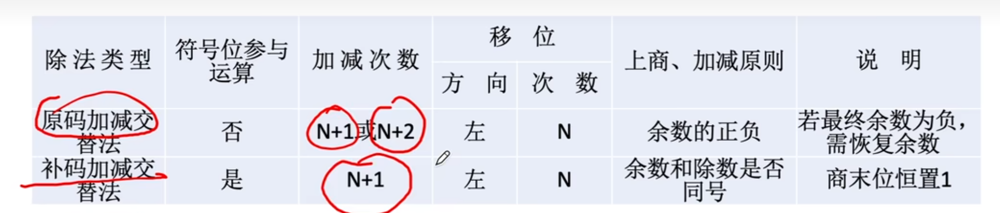

 
# 计算机组成

## 性能指标


## Bin Coded Dec(BCD码)


## 无符号整数的运算


## 带符号整数的表示

### 原码

其实就是第一位表示符号，后面表示原数。顺带一提，这种方式不常用的原因并不是比补码少了那一个数的表示范围，而是符号位不能参与运算，从而使运算电路变复杂。

### 补码

与原码的区别是，当符号位为1时，其要表示的数是数值位取反再+1。
**原码和补码之间相互转换的规则是相同的，都是取反码再+1，如果你想求一个intx_t的相反数，就连带着符号为一起取反码，再+1**

### 移码

将补码的符号位反转

定义如下


## 定点小数

与定点整数的区别是，在扩展位数时补0的位置不同。实际上是对同一个二进制串的不同解释。

$0.x_1 x_2 x_3 x_4 x_5 x_6 x_7 \to 0.x_1 \cdot 2^{-1} + x_2 \cdot 2^{-2} ...$

小数点前面的是符号位

# 算术逻辑单元(ALU)

## 码运算




## 原码的乘法运算


```cpp
uint32_t quick_mul(uint32_t x, uint32_t y)
{
    uint64_t r = y;
    for(uint8_t i=0;i<32;i++)
    {
        if(r & 1)
            *((uint32_t*)&r + 1) += x;
        r = r>>1;
    }
    return r;
}
```

## 补码的乘法运算 (Booth算法)


## 除法运算




## 浮点数的规格化

* 若浮点数的尾数的最高位是无效值，则会损失精度


对于原码，尾数的最高位必须是1。对于补码，正数与原码相同。负数的补码的最高位必须是有效位0。


## IEEE

我来告诉你为什么IEEE的阶码不能直接把符号位取反求移码。因为IEEE规定的移码偏置值不是$2^{n-1}$，对于8位阶码，他是127。

* float   1+8+23   偏置：127
* double  1+11+52  偏置：1023
* ldouble 1+15+64  偏置：16383


# 存储器

## 存储器的层次化结构


## DRAM(主存)的原理

(合着RAM真就是每个存储单元配译码器的一根线呗)


## DRAM和SRAM

* SRAM: 以双稳态触发器构成，造价高，速度快，用于CPU高速缓存
* DRAM: 以栅极电容电力构成，造价低，容量大，用于主存

## 提高主存速度的方法

