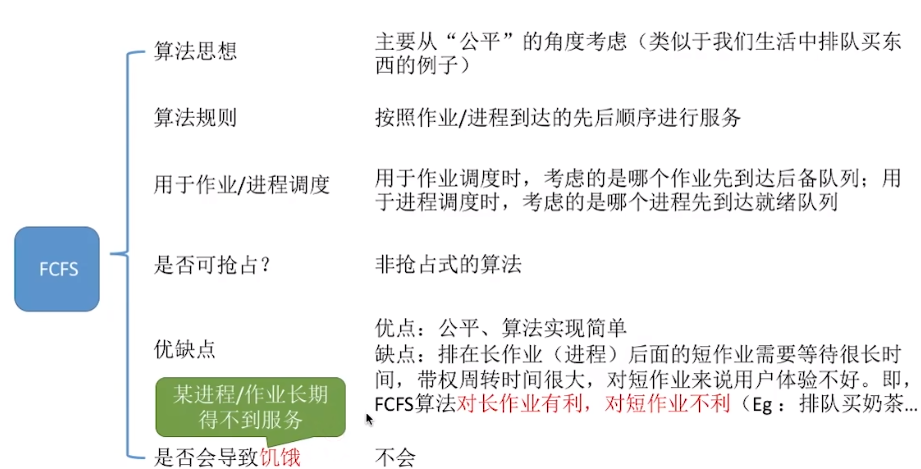
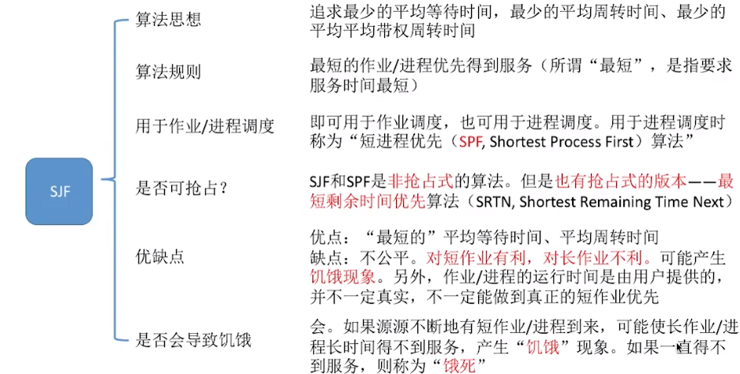
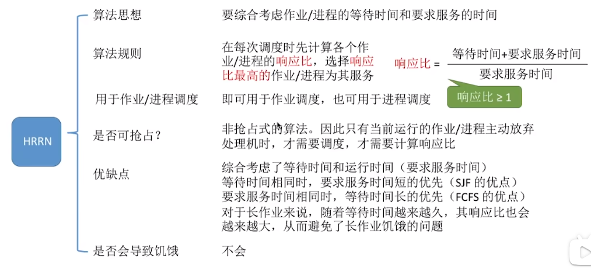
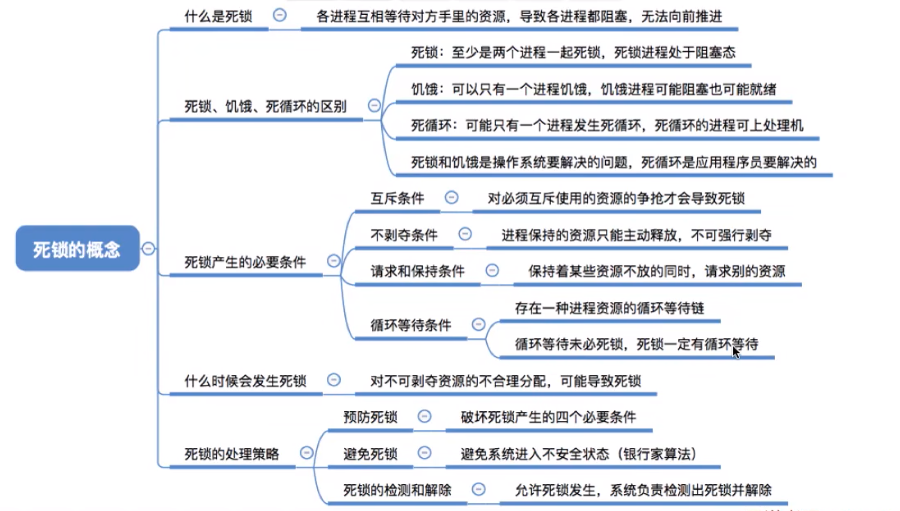
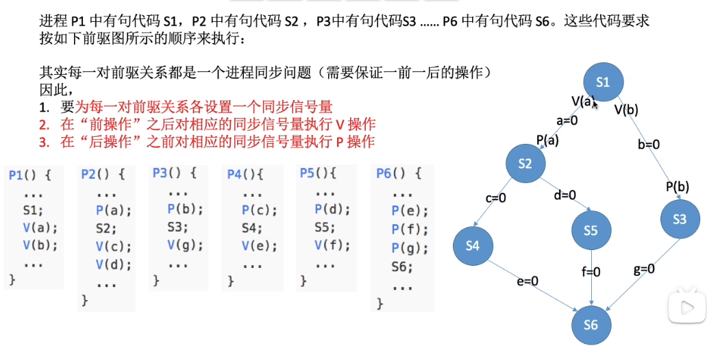

# 深入理解计算机系统

## &emsp;1.计算机系统漫游

### &emsp;&emsp;1-1 信息 = 位 + 上下文

### &emsp;&emsp;1-7 操作系统的作用

&emsp;&emsp;&emsp;文件是对IO设备的抽象表示
&emsp;&emsp;&emsp;虚拟内存是对主存和磁盘IO设备的抽象表示
&emsp;&emsp;&emsp;进程则是对处理器、主存和IO设备的抽象表示

## &emsp; 2.信息的表示和处理

### &emsp;&emsp;2-1 信息的储存

&emsp;&emsp;&emsp;字节顺序主要分“大端序”和“小端序”，目前广泛使用的是小端序，即“低位在低地址”

``` cpp
int main() {
    uint8_t byte_stream[4] = { 0x78, 0x56, 0x34, 0x12 };
    uint32_t cm = 0x12345678;

    cout << (*(uint32_t*)byte_stream == cm) << endl;
    // Will Print "1" 
    return 0;
}
```

## &emsp;3.程序的机器级表示

### &emsp;&emsp;3-2 程序编码

&emsp;&emsp;&emsp;程序计数器 (或被称为PC或%rip),指向 ***下一条*** 要执行的指令的地址

* x86-64 的指令长度从1到15字节不等
* 机器码从某个给定的位置开始，必然可以把字节序列唯一地解码为机器指令

&emsp;&emsp;&emsp;顺带一提，函数之间的nop是为了让代码与页面对齐。所以区分函数最好参考符号表，而不是参考nop

### &emsp;&emsp;3-4 访问信息

&emsp;&emsp;&emsp; x86体系中的某些寄存器有特殊的作用:

* %rax 储存函数返回值
* %rdi, %rsi, %rdx, %rcx, %r8, %r9 分别保存第 1-6个参数
* %rsp 栈指针

&emsp;&emsp;&emsp; **mov指令的两个参数不能都是内存引用，所以别疑惑为什么反编译出的代码在执行内存->内存数据操作时，要在寄存器里面倒一遍了**

```asm

; X is At 0x1000, Y is At 0x1004
; Swap X and Y
; ASM At GNU

movq 0x1000, %rbp  ; Save base address

movl (%rbp),  %eax
movl 4(%rbp), %ebx
movl %ebx, (%rbp)
movl %eax, 4(%rbp)

```

&emsp;&emsp;&emsp; 加载有效地址(lea)指令，其实本质就是一个算术，别理解复杂了

### &emsp;&emsp;3-6 控制

&emsp;&emsp;&emsp; 除整数寄存器之外，CPU还维护着一组 **条件寄存器** 用于保存操作的附加信息

* CF: 进位标志
* ZF: 零标志
* SF: 符号标志
* OF: 溢出标志

&emsp;&emsp;&emsp; 跳转指令(如jmp/jg)，经常使用相对地址进行寻址。
&emsp;&emsp;&emsp; 在下面的代码中，jmp向前跳转到更高的地址， jg向后跳转到更低的地址

```asm
0x0     mov %rdi, %rax
0x3     jmp 8
0x5     sar %rax
0x8     test %rax, %rax
0xB     jg 5
0xD     ret              ; repz rerq
```

### &emsp;&emsp;3-7 过程

&emsp;&emsp;&emsp; x86-64 体系中，用call指令调用过程。对于过程的调用通常经历以下几步:

1. 将寄存器数值入栈
2. 将参数存放到对应的寄存器中
3. 将返回地址入栈

&emsp;&emsp;&emsp; 其中1、3步由硬件完成，汇编程序只需要完成第2步

```asm

400540  lea     0x2(%rdi), %rax
400544  ret

400545  sub     $0x5, %rdi
400549  call    400540
40054E  add     %rax, %rax
400551  ret

40055B  call    400545
400560  mov     %rax, %rbx
```

&emsp;&emsp;&emsp; 有些时候，编译器会使用运行时栈传递参数，而不是寄存器。

1. 寄存器不足以保存所有数据
2. 对实参使用'&'取地址 (虽然我们不推荐这种做法)

&emsp;&emsp;&emsp; 在除了传递参数之外的情况，编译器选择使用寄存器还是栈去保存局部变量的策略也是类似的。但有一点必须额外说明，当局部变量是一个数组或结构体时，必须能够通过 基址+偏移 的方式去访问他们，这时编译器也会把他们储存在栈上。

### &emsp;&emsp;3-9 数据对齐

&emsp;&emsp;&emsp; 许多计算机系统对基本数据类型的合法地址作出了限制。其原因究其根本，是因为CPU分块访问内存。比如在x86-64体系中，一个uint64_t类型的数据，其地址被建议是是8的整倍数。因为如果一个数据位于两个内存块的交界处，CPU为了读取一个uint64类型的数据，需要进行两次内存操作，这显然大幅度地浪费了性能。<br>
&emsp;&emsp;&emsp; x86体系仅仅是对地址对齐进行了建议，但有很多体系是强制数据进行块对齐的

### &emsp;&emsp;3-10 内存越界和缓冲区溢出

&emsp;&emsp;&emsp; 处理在栈上的数据时要额外小心，不要忘记，栈上不仅保存着函数的局部变量，还保存着 **函数的返回地址** 和 **调用者保存的寄存器状态** 在一些情况下，对栈结构的破坏会导致非常严重的后果。

&emsp;&emsp;&emsp; 在现代计算机系统中，**栈随机化**是对抗缓冲区溢出攻击的一种标准手段。因为攻击者如果想通过栈溢出攻击去执行任意代码，他不止需要把代码写入内存，还需要确定代码的基地址。具体参考(ASLR)，即使是一个可执行程序，它在内存中加载的基地址也不是确定的。<br>
&emsp;&emsp;&emsp; 然而实际上，这种简单的溢出攻击对于现代计算机系统来说几乎是幼稚而荒唐的。对于几乎所有的服务器系统，MPU(Memory Protection Unit)都是他们的标配。这意味着只有拥有‘执行’属性的内存页面才能被执行。<br>
&emsp;&emsp;&emsp; 但是也不排除有一些低级的物联网嵌入式系统不配备有MPU，这一点要额外注意。

**回头别忘了练习题**

## &emsp;4.进程管理

### &emsp;&emsp;4-1 程序、进程和线程

#### &emsp;&emsp;&emsp; 几个重要概念

1. 程序：编译过的、可执行的二进制代码。
2. 进程：正在运行的程序、以及其包括的全部资源。包括虚拟内存实例、内核资源、安全上下文。
3. 线程：进程内的活动单元。包含自己的虚拟储存器，调用栈，以及指令指针。

### &emsp;&emsp;4-2 进程ID

#### &emsp;&emsp;&emsp; 空闲进程

&emsp;&emsp;&emsp; 没有其他进程在运行时，内核所运行的进程。pid=0

#### &emsp;&emsp;&emsp; init进程

&emsp;&emsp;&emsp; 在用户不显式地指定内核需要运行的init程序的情况下，内核会自己指定合适的init程序，其策略(搜索顺序)如下。<br>

1. /sbin/init &emsp;&emsp;**内核期望init程序存在的地方**
2. /etc/init
3. /bin/init
4. /bin/sh    &emsp;&emsp;&emsp;**Bourne shell 所在的位置，若内核没有找到init程序，就会尝试运行它**

&emsp;&emsp;&emsp; 在以上四个位置中，最先被发现的会被当作init执行。在四次运行全部失败，内核就会报警，系统挂起。<br>
&emsp;&emsp;&emsp; 否则，系统会交出控制权，init完成后续启动过程。

#### &emsp;&emsp;&emsp; 进程体系

&emsp;&emsp;&emsp; 创建新进程的那个进程被称为父进程，新进程被称为子进程。**每个进程都是由其他进程创建的**，除了init进程。因此每个进程都有一个父进程，并保存在ppid中。<br>
&emsp;&emsp;&emsp; 每个进程都属于一个**用户**和**组**，这种从属关系用来实现访问控制。每个子进程都继承了父进程的用户和组。

### &emsp;&emsp;4-3 exec系列函数

&emsp;&emsp;&emsp; 在Unix中，创建新进程与把程序载入内存并执行的操作时相互分离的。一次系统调用会把二进制程序加载到内存中，替换地址空间原来的内容并开始执行。这个过程就称为 **"执行(Execute)"**

```cpp

#include <unistd.h>

int excel(const char* path,
          const char* arg1,
          ...);

```

&emsp;&emsp;&emsp; excel() 用path所指的映像替换当前进程的映像。arg1是它的第一个参数，excel() 是可变参数的，而参数表必须以NULL结尾。若excel() 调用成功，它的下一行代码将没有机会执行，因为进程映像已被替换。

```cpp

int ret;

ret = excel("/bin/vi", "vi", NULL);
if(ret == -1)     // This line will not be executed if excel() success
    perror("excel");

```

&emsp;&emsp;&emsp; 成功的 execl() 会改变进程的以下属性：

1. 所有的挂起信号都会消失
2. 丢失所有的内存锁
3. 线程的属性会还原成默认值
4. 重置大多数的统计信息
5. 清空只存在于用户空间的数据

### &emsp;&emsp;4-4 fork()系统调用

&emsp;&emsp;&emsp; 创建一个几乎与父进程完全相同的子进程，并从fork()处开始执行。

* 在父进程中，fork()返回子进程的pid
* 在子进程中，fork()返回0
* 失败的fork()会返回-1

### &emsp;&emsp;4-5 atexit()

&emsp;&emsp;&emsp; 可以注册进程在结束时要调用的函数:

```cpp
#include <stdlib.h>

int atexit(void(*funtion)(void));
```

&emsp;&emsp;&emsp; 若程序正常结束 **(调用exit()或从main()中返回)**，用atexit()注册的函数将会被调用。exec系列函数会清空atexit注册的函数列表。

## &emsp;5.进程的内部机制

### &emsp;&emsp;5-1 异常控制流

#### &emsp;&emsp;&emsp; 异常

 
<br>

&emsp;&emsp;&emsp; 异常可以被解释为控制流中的突变，其大致可以分成四种：

* 中断 (总是返回)
* 陷阱 (总是返回)
* 故障 (可能返回)
* 终止 (从不返回)

#### &emsp;&emsp;&emsp; 中断

&emsp;&emsp;&emsp; 通常来自于IO设备。每当CPU执行完一条指令，它就会检查中断引脚，若电平变高，就从系统总线读取异常号然后调用适当的处理程序。

#### &emsp;&emsp;&emsp; 陷阱(Trap)和系统调用

&emsp;&emsp;&emsp; "陷阱" 这个名词很有迷惑性，因为应用程序经常是"自投罗网"的。准确来说，陷阱是有意的异常，是执行一条指令的结果。<br>
&emsp;&emsp;&emsp; 而其最重要的作用，就是在用户程序和系统内核之间建立一个调用接口，称为 **系统调用 (System Call)** 。通常来说，读写IO设备、创建新进程这类操作都是受到操作系统保护的 **特权操作**，只有内核代码才有权进行。为了实现对这些操作的受控的访问，处理器提供了一条 **syscall n** 指令。<br>
&emsp;&emsp;&emsp; 当用户程序需要请求服务n时，可以执行 syscall n指令，触发一个Trap异常，从而使自己从 **用户态** 陷入到 **内核态**，然后内核代码解析参数，并调用适当的内核程序，最后返回到调用处。

&emsp;&emsp;&emsp; 在这里举一个例子，平时我们使用的printf从更加底层的角度可以这样实现：

```cpp
void writeToTty(const char* tty, const char* str)
{
    int fd = open(tty, O_WRONLY);       // 打开stdout所对应的tty文件
    syscall(1, fd, str, strlen(str));   // 触发1号系统调用，即write
    close(fd);                          // 关闭打开的文件对象
}
```

### &emsp;&emsp;5-2 并发流与并行流

&emsp;&emsp;&emsp; 若一个逻辑流在执行时间上与另一个流重叠，称为**并发流**<br>
&emsp;&emsp;&emsp; 若两个逻辑流并发地运行在不同的处理器核心上，我们称他们为**并行流**

### &emsp;&emsp;5-3 用户模式和内核模式

&emsp;&emsp;&emsp; 处理器通常是用某个模式位来描述进程当前拥有的特权等级。当设置了模式位时，进程就运行在**内核模式**中，否则就运行在用户模式中。<br>
&emsp;&emsp;&emsp; 用户模式中的进程不允许执行特权指令。<br>
&emsp;&emsp;&emsp; 运行应用程序代码的进程初始时是在用户模式中的。进程从用户模式变为内核模式的唯一方法是通过诸如**中断**、**故障**或者**陷入系统调用**这样的异常。此时，我们称内核“代表进程执行”并处于进程上下文中<br>
&emsp;&emsp;&emsp; 当异常发生时，控制传递到异常处理程序，处理器将模式从用户模式变为内核模式。处理程序运行在内核模式中，当它返回到应用程序代码时，处理器就把模式从内核模式改回到用户模式。

### &emsp;&emsp;5-4 上下文切换

#### &emsp;&emsp;&emsp; 上下文

&emsp;&emsp;&emsp; 内核为每个进程维持一个**上下文(context)**，上下文就是内核重新启动一个被抢占的进程所需的状态。

#### &emsp;&emsp;&emsp; 调度

&emsp;&emsp;&emsp; 在某些时候，内核可以决定立即抢占当前进程，并重新开始一个先前被抢占了的进程，这种决策就被称为**调度**，由内核中被称为**调度器**的代码处理的。

### &emsp;&emsp;5-5 进程描述符&任务结构

&emsp;&emsp;&emsp; 任务队列(task list)是一个双向循环链表，其每一项都是类型为 **task_struct** 的结构，被称为进程描述符。<br>
&emsp;&emsp;&emsp; **task_struct** 相对较大，在32位机器上，它大约有1.7kB。在较新版本的linux系统中，这个结构通过slab分配器动态分配。为了避免每次访问进程描述符都需要遍历进程表，linux在每个进程的内核栈的一端保存了一个新的结构 **thread_info**。

```cpp
struct thread_info {
    struct pcb_struct pcb;    /* palcode state */
 
    struct task_struct *task;  /* main task structure */
    unsigned int flags; /* low level flags */
    unsigned int ieee_state;    /* see fpu.h */
 
    struct exec_domain *exec_domain; /* execution domain */
    mm_segment_t addr_limit; /* thread address space */
    unsigned cpu;   /* current CPU */
    int preempt_count; /* 0 => preemptable, <0 => BUG */
 
    int bpt_nsaved;
    unsigned long bpt_addr[2];  /* breakpoint handling  */
    unsigned int bpt_insn[2];
 
    struct restart_block restart_block;
};
```

### &emsp;&emsp;5-6 进程状态

&emsp;&emsp;&emsp; 进程描述符中的state字段描述了进程当前的状态，系统中的任何一个进程都必然处于下面五种进程状态之一：

* **TASK_RUNNING(运行)** 进程是可以被执行的。它有可能正在被执行，也有可能在运行队列中等待被执行(这种状态也被称为就绪态)。在用户空间中正在被执行的进程仅有可能处于该状态。

* **TASK_INTERRUPTIBLE(可中断)** 进程正在被阻塞，等待某些条件的达成。一旦这些条件达成，内核就会把进程的状态设置为**TASK_RUNNING**，处于该状态的进程会因为收到信号而被提前唤醒。

* **TASK_UNINTERRUPTIBLE(不可中断)** 除了即使收到信号也不会被唤醒之外，这个状态与 **TASK_INTERRUPTIBLE** 相同。

* **_TASK_TRACED(跟踪)** 这个进程在被其他进程跟踪。

* **_TASK_STOPPED(挂起)** 这个进程没有投入运行也不可以投入运行。这种状态发生在进程接收到特定的信号的时候，或者在调试状态下接收到任何信号的时候。

&emsp;&emsp;&emsp;&emsp;&emsp;&emsp;&emsp;&emsp;&emsp;&emsp;&emsp;&emsp;&emsp;&emsp;   

### &emsp;&emsp;5-7 进程的终结

&emsp;&emsp;&emsp; 一般来说，进程的终结是自身引起的，它发生在进程调用exit()的时候。当进程接收到它不能忽视也不能处理的信号时，它也有可能被被动地终结。

* **僵尸进程** 在调用do_exit() 之后，尽管进程已经不能再运行了，操作系统还是保留了它的进程描述符。这是为了在子进程结束之后，父进程仍然能获取到关于它的信息。只有当父进程获取到已终结的进程的信息，或者通知进程不再需要这些信息时，子进程的task_struct才会被释放。**这种已经不再被执行，只在内核中剩下一个空壳的进程，就被称为僵尸进程**

* **孤儿进程** 如果父进程在子进程之前退出，必须有一个机制，能保证子进程能找到一个新的父亲。事实上，内核会在其所在的进程组内找一个进程作为它的父亲，如果实在找不到，就让init做它的父亲。

## &emsp;6. 进程的调度

### &emsp;&emsp;6-0 调度器的评价标准&老式调度算法

* 等待时间是进程等待处理器服务时间之和，包括被抢占而等待

$$CPU利用率=\frac{忙碌的时间}{总工作时间}$$

$$系统吞吐量=\frac{完成工作数}{时间}$$

$$周转时间=完成时间-提交时间$$

$$平均周转时间=\frac{周转时间和}{作业数}$$

$$带权周转时间=\frac{作业周转时间}{实际运行时间}$$

* 先来先服务(FCFS)



* 短作业优先(SJF)



* 最高响应比优先(HRRN)


#### 死锁&饥饿&死循环



#### 死锁的必要条件

* 互斥条件：对必须互斥访问的资源的争抢才可能导致死锁
* 不剥夺条件：一个进程无法抢占其他进程的资源
* 请求和保持条件：进程已经占有一个资源，但仍需要其他进程手里的资源，请求进程被阻塞，但还捏着手中的资源不放
* 循环等待条件：存在进程的循环等待链 
* 总之：对不可资源的不

### &emsp;&emsp;6-1 多任务

#### &emsp;&emsp;&emsp; 调度器

&emsp;&emsp;&emsp; 从1991年Linux的初版，到后来的2.4内核，Linux的调度器程序都相当简单，或者说简陋，这让他在众多可运行进程或多处理器的环境下难以胜任。<br>
&emsp;&emsp;&emsp; 直到2.5版本，调度程序被大幅度修改。开发人员引入了一种被称为O(1)调度程序的新调度程序。而为了优化对交互式程序的响应速度，在2.6版本，开发人员引入了新的调度算法，其中最著名的是 **"反转楼梯最后期限调度算法(RSDL)"** 

### &emsp;&emsp;6-2 调度策略

#### &emsp;&emsp;&emsp; I/O消耗型 & 处理器消耗型

* I/O消耗型

&emsp;&emsp;&emsp; 这种类型的进程经常处于可运行状态，但通常都是短短的一会儿。他们的大部分时间都在等待IO设备的响应(比如键盘输入，磁盘读写，网络数据)。<br>
&emsp;&emsp;&emsp; 一个典型的例子便是GUI程序，他们大多数时间都在等待鼠标键盘的输入。

* 处理器消耗型

&emsp;&emsp;&emsp; 与I/O消耗型相反，这种进程把大部分时间用在执行代码上。对于这类进程，调度器会尽量降低它们的运行频率，而提升它们的运行时间。<br>
&emsp;&emsp;&emsp; 一个典型的例子是执行大量数学计算的程序，比如MATLAB。<br>
&emsp;&emsp;&emsp; 总得来说，对于I/O消耗型程序，调度器会在他们希望得到控制权时尽量快速地满足他们。而对于处理器消耗型程序，调度器会尽量分配给他们较长的运行时间。

### &emsp;&emsp;6-3 CFS(公平调度器)

&emsp;&emsp;&emsp; 在Linux中，与CFS调度器有关的代码位于 **kernel/sched_fair.c** 中，以下四个组成部分比较重要：

* 时间记账
* 进程选择
* 调度器入口
* 催眠和唤醒

#### &emsp;&emsp;&emsp; 时间记账

1. 调度器实体结构

&emsp;&emsp;&emsp; CFS中没有时间片的概念，但是他仍然必须维护每个进程的运行时间记账。CFS使用调度器实体结构来进行运行事件记账。

```cpp
struct sched_entity {
 struct load_weight  load;
 struct rb_node   run_node;
 u64    deadline;
 u64    min_vruntime;
 struct list_head  group_node;
 unsigned int   on_rq;
 u64    exec_start;
 u64    sum_exec_runtime;
 u64    prev_sum_exec_runtime;
 u64    vruntime;
 s64    vlag;
 u64    slice;
 u64    nr_migrations;

#ifdef CONFIG_FAIR_GROUP_SCHED
 int    depth;
 struct sched_entity  *parent;
 /* rq on which this entity is (to be) queued: */
 struct cfs_rq   *cfs_rq;
 /* rq "owned" by this entity/group: */
 struct cfs_rq   *my_q;
 /* cached value of my_q->h_nr_running */
 unsigned long   runnable_weight;
#endif

#ifdef CONFIG_SMP
 struct sched_avg  avg;
#endif
};
```

&emsp;&emsp;&emsp; 调度器实体作为一个名为se的字段，嵌入在进程描述符中。

2. 虚拟实时

&emsp;&emsp;&emsp; **u64 vruntime;** 字段保存了进程的虚拟运行时间，以ns为单位。CFS用这个变量记录一个进程运行了多少时间，以及它还应该运行多久。事实上，如果我们有一个理想的多任务处理系统，vruntime将是不必要的。<br>
&emsp;&emsp;&emsp; 只要每个进程的运行时间都趋近于无穷小，他们就可以完美地占有处理器性能的一部分。然而在实际情况下，进程的调度需要消耗时间。无穷小的进程运行时间会导致调度进程消耗的时间占据了处理器的全部运行时间。

3. 进程选择

&emsp;&emsp;&emsp; CFS试图用一个简单的规则去均衡所有进程的运行时间，当CFS需要选择下一个运行进程时，它会挑选一个具有最小vruntime的进程，实际上这就是CFS调度算法的核心。<br>
&emsp;&emsp;&emsp; 

## &emsp;补充6

### 互斥&同步&前驱

* 互斥：这件事同时只能有一个进程在做

本质就是对应同一个信号量的临界区，同时只能有一个进程进入并执行。

* 同步：我做完这件事，你才能做那件事

一个进程必须等待另一个进程完成指定的操作，才能继续执行。

* 前驱：多级同步问题的雅称



## 7.虚拟内存


