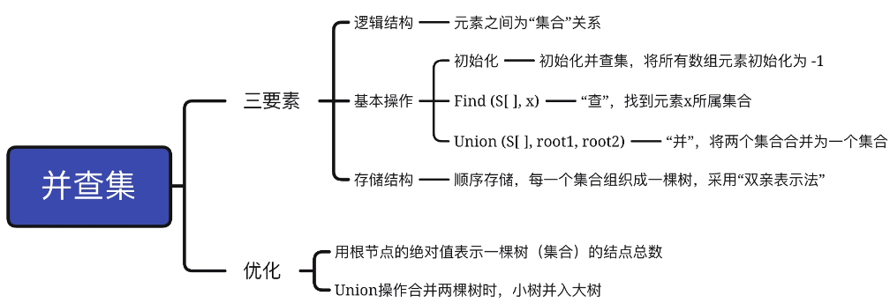
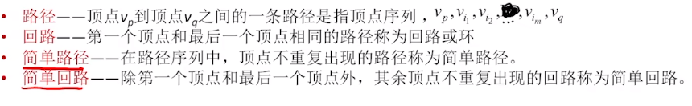
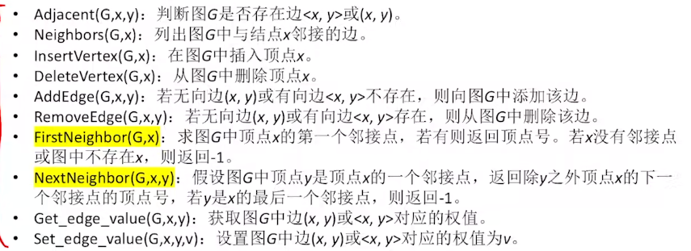

# 数据结构与算法

## &emsp; 1. 串

### &emsp;&emsp; 1-1 朴素模式匹配算法

* 子串 : 主串的一部分,一定存在
* 模式串 : 不一定能在主串中找到

* **(暴力法,不多说)**

### &emsp;&emsp; 1-2 KMP算法

* 关键点:先从模式串中计算出next数组
&emsp;&emsp;&emsp; next数组表示(next[j]): 在模式串的第j位发生失配时,若不移动i指针.应将j指针移动到哪个位置

```cpp
vector<int> get_str_next(const string& str)
{
    vector<int> r;
    r.push_back(-1);
    r.push_back(0);

    for(int i=2;i<str.length();i++)
    {
        for(int j=1;j<=i;j++)
        {
            if(mem_pair(str.c_str(), str.c_str() + j, i - j)) // mem_pair: 检测两个内存地址开始的l个字节是否匹配
            {
                r.push_back(i - j); //若匹配, 则计算出偏移(i - j), 并推入缓冲区
                break;
            }
        }
    }
    return r;
}
```

&emsp;&emsp;&emsp; 剩余的匹配算法则比较简单:

```cpp
bool kmp_contains(const string& major, const string& mode, const vector<int>& next)
{
    int i=0, j=0;

    while(1)
    {
        if(major[i] == mode[j])  // 两字符相等
        {
            if(j == mode.length() - 1) return true;  // 如果已经匹配到模式串的最后一个字符,说明匹配成功
            i++;
            j++;  // 将两个指针都后移
        }
        else
        {
            if(i + mode.length() >= major.length()) return false;
            // 若i后的字符已经比模式串短, 则已经不可能再匹配成功
            j = next[j]; // 跳转 j
            if(j == -1)
            {
                i++;
                j++;
            }
        }
    }
}
```

* nextval数组: 若next[j]所指向的元素的值,与j指向的元素的值相等。那么还可以将next[j]的值减1。

## &emsp; 2. 树

* 简而言之，所有节点都最多只有一个前驱的图
* 空树：节点数为0的树
* 非空树的特性：有且只有一个**根**节点
* 根节点：唯一一个没有前驱的节点
* 叶子节点：没有后继的节点
* 分枝节点：有后继的节点

### &emsp;&emsp; 2-1 树的性质

* **节点数** = 总度数 + 1
* **树的度**：各个节点的度的最大值(至少有一个节点有这个最大值个分支)
* **n叉树**：每个节点都最多只能有n个分支
* n叉树的第 $i$ 层至多有 $n^{i-1}$ 个节点
* 高度为 $h$ 的 $n$ 叉树至多有 $\frac {m^h-1}{m-1}$ 个节点

### &emsp;&emsp; 2-2 二叉树

* 把满二叉树节点按层序编号，节点 $i$ 的左孩子为 $2i$，右孩子为 $2i+1$，节点 $i$ 的父节点为 $[i/2]$。
* **完全二叉树**：把满二叉树的节点删去若干个最大的。

* **二叉排序树**：**左子树**上的所有节点的关键字均**小于根节点**的关键字；**右子树**上的所有节点的关键字均**大于根节点**的关键字；左子树和右子树又各是一棵二叉排序树

* **平衡二叉树**：树上任一节点的**左子树**和**右子树**的深度之差**不超过一**

#### &emsp;&emsp;&emsp; 常见规律

* 设非空二叉树中度为0、1、2的节点个数分别为 $n_0$、 $n_1$、 $n_2$，则 $n_0=n_2+1$
* 具有 $n$ 个节点的完全二叉树的高度为 $[h=log_2(n+1)]$ 或 $[log_2n]+1$ 

### &emsp;&emsp; 2-3 二叉树的存储

1. **顺序存储**

```cpp
#define MAX 100

struct TreeNode
{
    T value;
    bool isEmpty;
};

TreeNode t[MAX];
```

&emsp;&emsp;&emsp; t中存储的是一个完全二叉树，按照上$\to$下，左$\to$右的方式编号，并顺序存储。

2. **链式存储** 略，刻进DNA里了

### &emsp;&emsp; 2-4 二叉树的遍历

* **先序遍历** ： 根左右
* **中序遍历** ： 左根右
* **后序遍历** ： 左右根

#### &emsp;&emsp; 递归太简单了，这里仅记录栈式迭代

```cpp
    vector<int> r;          // 遍历的结果
    stack<TreeNode*> st;    // 遍历栈
    TreeNode* pNode = &root;// 节点指针

    while(pNode || !st.empty())
    {
        if(pNode)   // 访问的不是空节点
        {
            r.push_back(pNode->val); // 先访问一波，显然这是先序遍历
            st.push(pNode);          // 入栈，给自己一条回头路
            pNode = pNode->left;     // 把指针移到左边
        }
        else        // 走到死路了
        {
            pNode = st.top();        // 没路了就回头
            st.pop();                // 不需要再记忆这个回头路了
            pNode = pNode->right;    // 既然走了回头路，那说明肯定是在上一个路口往左走的，这次往右走
        }
    }
```

* **层序遍历**

##### &emsp;&emsp; 有些时候会要求分层，有些时候不需要把每层分开，按照顺序即可。基本思路是队列式迭代

```cpp
vector<vector<int>> levelOrder(TreeNode* root) {
    queue<TreeNode*> list;  // 缓存队列
    vector<vector<int>> r;  // 结果，这里是分层的。不分层更简单
    if(!root) return r;     // 排除空树
    list.push(root);        // 根节点入队

    while(!list.empty())    // 队空了就没有要遍历的了
    {
        vector<int> b;      // 储存本层的元素
        int size = list.size(); // 记录当前层的节点数

        for(int i=0;i<size;i++) // 遍历队列当前层的节点
        {
            auto node = list.front();   
            b.push_back(node->val);
            if(node->left) list.push(node->left);
            if(node->right) list.push(node->right); // 把下一层的都搞进来
            list.pop();
        }

        r.push_back(b);
    }

    return r;
}
```

### &emsp;&emsp; 2-5 二叉树的构造

* 以下三种遍历方式的组合可以推出一条完整的二叉树

* 先序+中序
* 后序+中序
* 层序+中序

&emsp;&emsp;&emsp; 简单来说，先、后、层三种遍历方式可以确定根节点。然后根据根节点在中序遍历表中的位置，可以推出左右子树的节点数。
&emsp;&emsp;&emsp; 通过这种方式，我们又得到了左/右子树的先/后/层序遍历和中序遍历。递归即可。

```cpp
TreeNode* tree_construct(vector<int> fe, vector<int> me)
{
    if(fe.empty()) return nullptr;  // 遍历表为空则直接返回空节点
    auto root = new TreeNode{       // 构造一个新的根节点
            .val = fe[0],
            .left = nullptr,
            .right = nullptr
    };

    if(fe.size() == 1)              // 遍历表长度为1,说明是叶子节点
    {
        return root;                // 直接返回
    }

    long ss = std::find(me.begin(), me.end(), fe[0]) - me.begin();  // 在中序遍历表中找到根节点

    vector<int> lfe(fe.begin()+ 1, fe.begin() + ss + 1);  // 根节点的左子树的先序遍历
    vector<int> lme(me.begin(), me.begin() + ss);   //   // 根节点的左子树的中序遍历
    root->left = tree_construct(
                lfe, lme
            );  // 递归左子树

    vector<int> rfe(fe.begin() + ss + 1, fe.end());
    vector<int> rme(me.begin() + ss + 1, me.end());

    root->right = tree_construct(
                rfe, rme
            );

    return root;
}
```

### &emsp;&emsp; 2-6 线索二叉树

##### &emsp;&emsp; 简而言之，有n个节点的二叉树，则必然有n+1个空节点。我们可以给二叉树的每个项加上一个tag：<br>

```cpp
struct TreeNode
{
    int val;
    TreeNode* left;
    TreeNode* right;

    unsigned int tag;        // bit1 for left enable; bit2 for right enable
};
```

如果left/right对应的tag被使能，则说明其表示的是自己在中序遍历下的前驱/后继(以中序线索二叉树为例)。

### &emsp;&emsp; 2-7 树的储存结构

#### &emsp;&emsp; 树能被转化为二叉树，具体过程略，别忘了孩子兄弟表示法

### &emsp;&emsp; 2-EX 并查集 (太简单了略)



## &emsp; 3-图

### &emsp;&emsp; 图的定义


* 图的边缘集合可以为空， 但图的顶点集合**不可以为空**!

#### &emsp;&emsp; 有向图&无向图

* 有向图

&emsp;&emsp;&emsp; 边缘集合E为一个有向边(也称弧)的有限集合。弧是顶点的有序对，记作$<v, w>$，v称为弧尾，w称为弧头。需要注意 $<v, w> != <w, v>$

$$G_1=(V_1, E_1)$$ 

$$V_!={A, B, C, D, E}$$

$$E_1={<A, B>, <A, C>, <A, D>, ...}$$


* 无向图

边缘集合E为一个有向边(也称边)的有限集合。边是顶点的无序对，记作$(v, w)$需要注意 $(v, w) = (w, v)$

#### &emsp;&emsp; 度&入度&出度

* 度(无向图)：依附于该顶点的边的条数，记作TD(v)
* 入度(有向图)：以顶点v为终点的有向边的数目，记为ID(v)
* 出度(有向图)：以顶点v为起点的有向边的数目，记为OD(v)
* 度(有向图)：入度和出度之和 TD(v) = ID(v) + OD(v)

#### &emsp;&emsp; 顶点-顶点关系



* 任意两个顶点都连通：连通图，否则：非连通图
* 任意两个顶点都强连通：强连通图

&emsp;&emsp;&emsp; 对于$n$个顶点的**无向图** $G$，
&emsp;&emsp;&emsp; 若$G$是连通图，则最少有$n-1$条边，
&emsp;&emsp;&emsp; 若$G$是非连通图，则最多可能有$C_{n-1}^2$ 条边

&emsp;&emsp;&emsp; 对于$n$个顶点的**有向图** $G$，
&emsp;&emsp;&emsp; 若$G$是强连通图，则最少有$n$条边，
&emsp;&emsp;&emsp; 若$G$是非连通图，则最多可能有$C_{n-1}^2$ 条边

### &emsp;&emsp; 图的存储

#### &emsp;&emsp; 邻接矩阵法

&emsp;&emsp;&emsp; 对于邻接矩阵$X$，$A^n$的元素$A^n[i][j]$为从顶点$i$到顶点$j$的，长度为$n$的路径的数目

#### 邻接表、十字链表、邻接多重表

### 图的基本操作



### BFS

